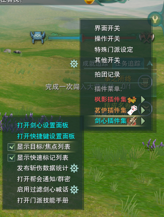

# 0 萌新

* 📄 [名词解释文档](siyuan://blocks/20240323133406-85agwlz)
* 📄 [萌新江湖用语](siyuan://blocks/20240325083431-r0aivsg)

孤僻星

**记住，游戏是用来放松的，不是用来坐牢的。**   
玩的开心最重要  
游戏主要是取悦自己，要让自己玩的开心

本攻略适用于小学数学、语文及格的十八岁成年玩家食用，0游戏基础也不要怕，不必须有RPG（角色扮演游戏）经验

此处仅为药宗从0开始的教学，其他职业玩家可以参考其中玩法入门等内容

所有设置不用萌新必须全部完成，只是一次性罗列清楚以便玩家能够更好体验游戏，与药宗玩法无关。

保持友善，勤学好问，一定能解决问题

联系方式：电五乾坤一掷-孤僻星星-Q：2731155821

---

关于游戏入门所遇到的所有术语名词，请跳转阅读**名词解释文档**

# 1.正确启动游戏

宝宝第一步，默认已正确下载安装打开游戏，并正确注册账号创建好自己的角色（选择北天药宗）

​​

请打开右侧插件管理，萌新**请加载所有插件，并使用默认设置**，熟悉游戏后根据自己需求自定义管理插件

​​

小贴士：

游戏不售卖数值道具，所有数值道具均来自玩家产出，游戏时间付费，外观不影响任何属性，尽可能保证游戏公平。

游戏目前采用点月卡计费方式，点月卡选择基于玩家在线时间，根据价格换算建议每天游戏在线时间大于4.5小时的玩家选择月卡，低于4.5小时选择点卡。

‍

游戏的正式内容在满级后才算正式开始，游戏升级分为，任务升级（不断完成任务获得新手装备）与直升（花钱跳过任务并获得启动资金）。

‍

**满级才进入这个大美江湖！**

‍

**重点：不懂就找人问，带着礼貌和友善，积极交流，一定能解决问题！推荐可以师徒界面找一个师父！**

‍

以下设置为萌新通用设置，药宗独有设置单列文档。

‍

# 2.自定义调整好操作

**工欲擅其事，必先利其器**

看攻略前一定已经自己体验过游戏，但是一定要设置好适合自己的操作模式才能获得更好的游戏体验。

## 2.1 基础操作

### 走路：

操作模式建议选择传统模式，将A键和D键设置成左右平移；利用鼠标按下左键移动实现转向，左手对键盘进行操作。

当然也有部分纯键盘流战士和鼠标辅助流大手子，自己用的习惯就好。

​​

设置方法：esc系统设置-快捷键设置-角色动作  

### 调整视角：默认使用左键拖动调整

### 调整面向：默认使用右键拖动调整，键盘面向默认位A向左转D向右转（可修改)

### 界面缩放和镜头设置：

镜头最大距离和广角拉大能够帮你观察战局，视角太局限就不好看，是不是有个天策从40尺外飞奔而来，或者你的奶妈在背后一直追着你奶。我习惯都拉最大，界面缩放可以按自己喜好调整。追随方式可以在智能追随和从不追随中选择自己喜欢的  
​​

设置方法：esc系统设置-游戏设置-综合

‍

## 2.2 骑马、轻功

默认使用T键上马，可以自行更换，新建立的小号默认没有马匹，需要自己装备背包内的拂晓

​​

江湖招式中有一系列和马相关的技能

双人同骑必须要有具有同骑属性（tips：当队友在可双骑坐骑上时，可以在地上发起上马申请，不用必须是马上邀请马下）

​​

## 大轻功

在非战斗状态，双击w进入大轻功，需要按住w，使用空格进行跳跃，shift可以进入进阶轻功，能进一步飞行，主要是赶路用，需要联系防止摔死，在副本内无法使用

大轻功需要消耗气力值，

新手避免摔死的方法，在落地前接一段小轻功或者使用送开w后双击w再次进入大轻功状态，会主动落地，不会受到掉落伤害

大轻功分为以下几课：

**1.紧急降落 2.定点降落 3.续航:合理利用滑翔 4.快速拔高 5.飞檐走壁 6.小轻功降落**

参考视频：https://www.bilibili.com/video/BV1Av411z71j

## 小轻功

二段跳：双击空格，更长滞空时间

后跳：默认为“s键+空格”向后跳跃，有免控时间

小轻功：扶摇、聂玉及四个方向的轻功，可以在战斗中使用，可以拖出到快捷栏，并使用鼠标点击

个人推荐小轻功放在快捷栏并设定好组合键，以便快速反应

‍

## 2.3.快捷键设置

### 快捷栏

游戏内绝大多数可以主动释放的功能都可以放到快捷栏

包括但不限于：

技能（江湖、门派、奇穴、百战）

道具（小吃、小药、除滞散、特效武器、任务道具、小铁、各种好看的玩意儿）

动作（表情、挂件、外观特效、玩具箱等）

功能（装备分解、宠物召唤、驯养等）

内置宏（自定义条件释放技能，但游戏内没有聊天宏，没有“辛苦啦宏”）

## 释放技能

单键：单击某个按键

组合键：同时按住两个按键，例如"shift+1"

武学助手：默认开启，在新手阶段不熟悉技能时可以使用，后期建议手打循环

长按连放：剑网三增加功能，在副本环境中，长按自动连续触发某个按键，野外和jjc不生效！！！

​​

设置方法：esc系统设置-游戏设置-操作开关-战斗操作开关

以下为一些优化快捷栏的设置教程：

（1）打开快捷栏和隐藏快捷栏背景

​​

设置方法：esc系统设置-游戏设置-快捷栏选项  
（2）常用键位设置  
最好设置能够容易按到的按键，不要傻傻的用alt+456，MU是前滚轮，MD是后滚轮，MB是滚轮按压，XB1、XB2是侧键键位，CL是大写锁定键；Ctrl、Alt、Shift可以搭配数字键及字母键使用。

设置方法：esc系统设置-快捷键设置  
(3)设置江湖小轻功快捷键  
成为一名pvp高手，需要学会使用江湖小轻功，后跳就是化劲

​​

设置方法：esc系统设置-快捷键设置-武功技能

进阶：后撤技能=一键后跳（后跳默认键位为S+空格），建议放入技能栏中  
后撤俗称后跳，可以说是pvp中最有用的技能，奶妈和高手dps必备，关键时刻能够逆转战局！

一般和江湖小轻功一同使用，如后撤+蹑云逐月

（4）设置白云、小剑、斧头目标选择快捷键  
PVP玩法中经常需要快速选择敌方目标进行转火、集火，用鼠标点或者tab键比较困难​

，所以需要用到快捷键选择。（需要在角色选择界面安装剑心插件集、茗伊插件集；下一部分会详细说明）

​​

设置方法：esc系统设置-快捷键设置-剑心插件集  
（5）奶妈职业选择目标推荐：  

快捷键设置最下面剑心插件集中打开选择血量最低队友

​​

OME3为键盘上 " ` "键 在上方数字键1的旁边，根据个人习惯调整

‍

### 3.血条设置

打开自身及队友、对面的血条，血条最好设置的粗一点，方便观察玩家血量  

​​

设置方法：esc系统设置-游戏设置-头顶文字效果（自行设置血条长宽）

‍

# 3.了解门派机制

选择了药宗，就代表了要了解药宗的文化，学习药宗的机制。

​​

## 中和

北天药宗有一个特殊能量条，施放温性技能则积攒温性槽，施放寒性技能则积攒寒性槽——在能量条上会有很漂亮的类似开花的特效；

​​

输出心法和治疗心法的主要套路都恰好遵循着2温2寒的布局，恰好能满足“温性”技能与“寒性”技能相组合的形式。

温性和寒性很直观地对应了传统中医学中药草的秉性，而在交错使用寒性和温性技能时，就会产生“中和”的效果。当处于输出心法“无方”状态时，中和效果会对目标造成一次伤害并附加“逆乱”的持续伤害；而处于辅助治疗心法“灵素”状态时，中和效果则会立刻对30尺范围内血量最低的团队成员进行一次治疗。

这个机制很简单易懂，其实也就是使用技能时确保“温寒平衡”，就可以不断发挥中和效果，博取最高收益。在我游玩时，其实感觉“中和”效果还是相对比较平稳的，需要长时间积累才能确保收益，也就是说，得确保在一场战斗时合理安排技能释放，达到尽可能多的中和，会是北天药宗的基础手法需求。

## 门派轻功——凌然天风

北天药宗可以在空中飞！不落地的那种！

在凌然天风状态下，每次释放一个技能就可以按一次空格进行一次跳跃，可以使用wasd使得该次跳跃具有方向，是药宗主要的滞空手段，也是药宗灵活性的来源。

## 心法

**灵素：根骨 毒性 治疗职业**

**无方：根骨 毒性 远程 输出职业**

职业详解请仔细阅读攻略，职业溯源请查看Z0 溯源内容。

‍

#### 新手选择任务升级的一点点攻略：

新手在选择药宗时，默认使用无方体验剧情做任务，建议建议使用武学助手辅助进行战斗，在遇到打不过的小怪时，优先将背包内装备换上最好的，在武学界面使用推荐的奇穴，遵循以下原则使用技能：

先打一个钩吻断肠，优先放苍棘缚地，然后去吃生成的种子，在符合一个寒技能，一个温技能的情况下，遵循那个亮了按那个，在被打了后使用凌然天风技能，跳起来怪物就打不到了

‍

然后在满级后，阅读攻略H1和D1部分，再进行职业选择，玩法选择，游玩过程不必贪多，注意破解，掌握游戏乐趣。

‍

## 具体技能

太多了，讲不完了

累了（孤僻星是咸鱼）

具体技能，根据自己喜好进行进一步阅读攻略，已根据玩法类型分类！！！

‍

# 4.插件设置（敲重点）

插件设置不用必须一次性设置完，优先看玩法攻略，而后根据自己玩法喜欢再进行自定义设置。

**工欲擅其事，必先利其器**

主要使用的插件是剑心插件集和茗伊插件集，已提醒全部加载。

## （1）剑心插件集：

①焦点目标列表：焦点列表可以帮助你快速选中附近的目标，还能观察对方的状态。  
​​

设置方法：

​​

②快速标记及集火列表：

​​

设置方法；右边小齿轮-剑心插件集-团队  
③目标连线：让你更容易判断敌人的方向  
​​

​​

设置方法：右边小齿轮-剑心插件集-常用

④技能增强：让你更方便、更准确地释放技能，选择设置。很多放置类技能，如奶毒的迷仙引梦、纯阳的生太极都更适合鼠标位置释放，这里用药奶的青川濯莲做示范。  
​​

设置方法：按住Ctrl键，将鼠标移动到技能图标上，可弹出这样的框框  
​​

记录下ID（示例为27669），并输入新建框内，设置释放方式。  
​​

​​

设置完成。  
⑤Buff增强：可以帮助你快速认识不同职业的技能效果，但准确性略低，可开可不开。就比如图中显示为“减伤”的buff，实际上是一个化解伤害量的盾buff。​

​​

设置方法：右边小齿轮-剑心插件集-BUFF增强

## （2）茗伊插件集：

打开茗伊插件集：  
​​

①团队面板基础：团队面板是pvp和pve都必须要使用的工具。这也是重点，设置好了JJC如开挂一般掌控全局）  
推荐奶妈职业勾选治疗辅助，能够快速在团队面板上选中队友开始奶而不用用快捷键选目标。  
​​

我习惯勾选第二个样式，红色是代表目标在20尺外，绿色则是在20尺内，灰色就是距目标太远无法选中。界面的宽度比例和高度比例可以自己调整，建议调大个一点，JJC一般就3个人也不碍地方；打战场可以调小一点点。  
​​

设置方法：右边小齿轮-茗伊插件集-团队

添加气劲设置列表，这点非常有用也非常重要！！  
团队面板监控可以帮助你看到自己队友的状态，比如队友是不是开减伤了，开免控了，队友是不是被控的动不了。有了这个就不要再问队友在干什么啦，直接从团队面板上看到他在干什么。如这个蓝色框框的图标就是表示队友被雷霆震怒这个技能眩晕，只能发呆QAQ。txt文件在下面放了链接，挂了直接去jx3box魔盒网站搜索，玩熟了可以自己探索buff列表，自己设置监控。  
​​

​​

​​

设置方法：右边小齿轮-茗伊插件集-团队-气劲设置-编辑-ctrl+V粘贴txt文件内容-确定

小贴士：勾选名剑大会、战场中取消屏蔽角色模型；勾选随身便笺方便打小抄记连招√  
​​

②茗伊监控设置：这是buff监控，pvp最重要的部分之一，通过buff来判断对面用了什么技能，见招拆招，就是pvp最有乐趣的地方！如图所示分别是奶秀or冰心的天地低昂，和纯阳的生太极免控、蛋壳化解盾。  
​​

​​

​​

​​

设置方法：右边小齿轮-茗伊插件集-目标-目标监控-导入-导入dat文件-通过esc自定义面板调整buff列表所在位置  
目标监控文件：[https://www.jx3box.com/jx3dat/41858](http://jump2.bdimg.com/safecheck/index?url=rN3wPs8te/pL4AOY0zAwh7epEygJozUR3CuZQKbzUSx35Hj2OvBHHynrkGQxQJ/U2b+OXmJkblH768BBuJObRN6RsZ4Sj8nn5poasj2gn5UKujVpuv055ebbkzv3iRQFSwtWm1naXuVsL4K+0eSh7HY9qHh6BM0y)【小蜜蜂】PVP团队监控 · 横刀断浪；用墨清河的也可以，在jx3box里搜或者问pvjjc亲友要就有啦！  
看到这里悟性高的小伙伴其实已经可以去JJC或者插旗试水了，毕竟实战才是游戏的乐趣所在！

进阶小贴士：在茗伊焦点列表中选中敌方药宗的草、明教的冰柱、奶毒的孔雀教学。草需要这样设置，冰柱和孔雀直接输入就可以。  
​​

​​

​  
剑三人物攻击面向是180°的，所以实战中如果被绕背经常会被提示“请正对目标”，在这里可以打开面向设置，更容易看到对面的面向，我是这样设的  
​​

‍

**工欲擅其事，必先利其器**

每个人的操作习惯不同，请根据自己的喜好自定义属于自己的游戏界面，调整好座椅才能舒适的驾驶快乐！

‍

需要视频参考可以看看

[可爱的大侄子 ](https://space.bilibili.com/335329715)给剑3小萌新的基础指南

https://www.bilibili.com/video/BV1oQ4y1C7A2

‍

‍

‍
