# 萌新江湖用语

转载，介意速删

---

不真道长

剑网3攻略作者 推栏ID：4885062

‍

## 前言

初入江湖，你就到了全新世界，它有自己的一些特定表达，你需要了解其含义，才能更快的融入。

注：之前写了《萌新之初闻江湖（江湖术语）》，但因为第一次写，内容比较凌乱，这里分版重制，这里记录角色相关术语。

感谢好友“水如梦”的帮助！

## 门派图标

​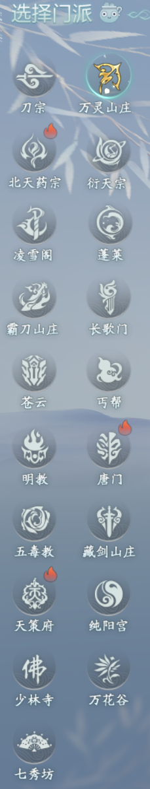​

## 职业

★T:主要针对PVE玩法来说，就是主要承受伤害的职业，吸引怪物仇恨。

★输出（DPS）：技能可以造成大量伤害，按输出距离分远程和近战，近战主要指技能大部分8尺以内输出，远程主要指大部分技能都是10尺以上距离输出， 根据伤害类型分内功输出和外功输出。

★治疗（奶妈）：技能可以为自己和其他玩家恢复生命，内力等，为自己或其他玩家提供BUFF，驱散DEBUFF，复活其他队友等，可以提高团队的持续作战能力。

★秀姐、秀萝、秀太：七秀门派成女、萝莉、正太体型别称。

★花哥、花姐、花萝、花太：万花门派成男、成女、萝莉、正太体型别称。

★喵T:明教使用T心法的简称。

★秀奶，药奶等：使用治疗心法和门派合并简称，便于区分，如秀奶指七秀奶妈。

★呱太：五毒门派的一个宠物，可以拉仇恨。

★毒哥、毒姐、毒萝、毒太：五毒门派成男、成女、萝莉、正太体型别称。

★东都狼、哈士奇：天策门派别称。

★军爷、军娘、军萝、军太：天策门派成男、成女、萝莉、正太体型玩家别称。

★鲸鱼、娃娃鱼：唐门的心法惊羽诀。

★田螺：唐门心法天罗诡道。

★炮哥、炮姐、炮萝、炮太：唐门成男、成女、萝莉、正太体型别称。

★咕咕：长歌门派别称。

★琴爹、琴娘、琴萝、琴太：长歌门派成男、成女、萝莉、正太体型别称。

★咩咩：纯阳门派别称。

★道长、道姑、咩萝、咩太：纯阳门派成男、成女、萝莉、正太体型别称。

★气纯：纯阳门派使用内功心法紫霞功的别称。

★剑纯：纯阳门派使用外攻心法太虚剑意的别称。

★貂貂：霸刀门派别称。

★刀爹、刀娘、刀萝、刀太：霸刀门派成男、成女、萝莉、正太体型别称。

★黄鸡：藏剑门派别称。

★二少、二小姐、叽萝、叽太：藏剑门派成男、成女、萝莉、正太体型别称。

★大师、小和尚：少林门派成男、正太体型别称。

★伞爹、伞娘、伞萝、伞太：蓬莱门派成男、成女、萝莉、正太体型别称。

★小野猪：凌雪阁门派别称，源自剧情中姬别情对玩家说得话。

​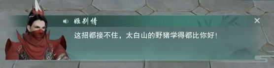​

★雪爹、雪娘、雪萝、雪太：凌雪阁门派成男、成女、萝莉、正太体型的别称。

★丐哥、丐姐、丐萝、丐太：丐帮门派成男、成女、萝莉、正太体型别称

★喵哥、喵姐、喵萝、喵太：明教门派成男、成女、萝莉、正太体型别称。

★苍爹、盾娘、盾萝、盾太：苍云门派成男、成女、萝莉、正太体型别称。

★灯爹、灯娘、灯萝、灯太：衍天宗成男、成女、萝莉、正太体型别称。

★药爹、药姐、药萝、药太：北天药宗成男、成女、萝莉、正太体型别称。

*注：一些不友好称呼未列出，如果侠友遇到了，自行搜索。*

## 武学

★心法：一个门派的不同修炼体系，选择不同心法有不同的技能，装备等，团队定位可能也会发生变更。

★技能：指武学招式，目前分江湖、门派、百战三大武学分支。

★秘籍：加强技能属性，让技能伤害更高，或者释放速度更快，或者消耗降低等。

★修为：用于切换奇穴，领悟秘籍，升级技能等，获取方式查看其他攻略。

★传功：其他玩家或者师徒，消耗自身修为补给你，反之亦然。

★打坐：快速回复自身的血量、内力等，必须在脱战状态下进行，默认快捷键V。

★读条：技能有的不能瞬发，需要一个运动时间。

★CD：冷却时间，就是一个技能你想连续释放的调息时间。

★GCD：共用冷却时间，就是你释放一个技能后，你再想用任何GCD技能，必须等这个GCD调息完才能使用。

★AOE：范围伤害技能。

★大轻功：连按两次W按键，进入大轻功模式再按SHIFT会进入门派特色大轻功，会消耗气力值，可以快速移动，翻越障碍物，注意关注当前气力值的多少，防止摔死。

★扶摇：江湖轻功[扶摇直上]简称。

​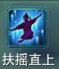​

★蹑云:江湖轻功[踏云逐月]简称。

​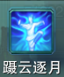​

★后跳：江湖轻功[后撤]简称，只能在地面使用，可以快速后退。

​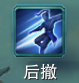​

★小轻功、江湖轻功：一般指扶摇直上、蹑云、左移【凌霄揽胜】、右移【瑶台枕鹤】、后移【迎风回浪】，不消耗气力值，常用于规避技能、短距离位移，或者滞空。

​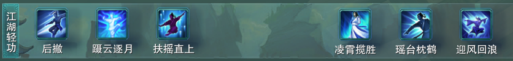​

★神行：江湖技能里[神行千里]的简称，一个快速跨图技能，默认30分钟冷却。

​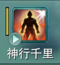​

★二段跳：指跳跃键起跳后，在空中再按一次跳跃键向上再跳一次，起跳下落是有一个缓冲时间的，第二次跳跃时机自己把握。

★自觉：江湖技能[自觉经脉]的简称。

​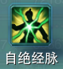​

## 装备

★小附魔：给装备增加属性，有时间限制，无法交易，一个赛季更新一次，需要根据自己职业选择属性。

​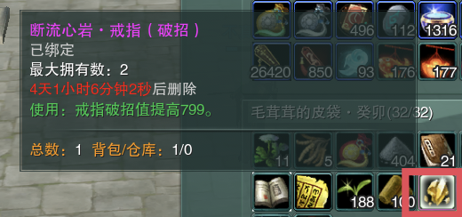​

★大附魔：给装备增加特殊效果，无时间限制，有装备品阶限制，一个赛季更新一次，需要根据职业选择类型。

​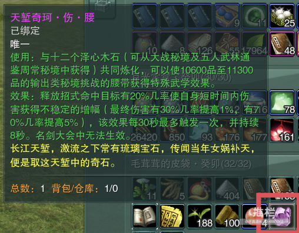​

★伤腰、御腰、疗腰：腰带大附魔简称，伤*****用，御***用，疗腰治疗职业使用，跟门派无关其他部位类比称呼。

★校服：指门派套装，通过侠行点或牌子进行兑换。

★切糕装备：指玩家通过生活技艺制造的装备。

★寻宝套：指消灭藏宝洞BOSS后，随机出的装备。

★战场套：通过竞技场累积货币兑换的装备。★阵营套：浩气，恶人对立阵营兑换的装备。★副本装：通过通关秘境等BOSS获取的装备。

★声望装：每个势力声望达到一定等级兑换的装备。

★江湖装：通过任务、或副本等获取的一种装备套装，也可以直接购买 。

★名望装：通过名望兑换的装备。

★小橙武：橙色品质武器，通过做任务获得，然后通过对应赛季的5R副本老三掉落的石头升级，有额外的技能属性加成。

注：小橙武需要达到五阶才有外观和特效。

​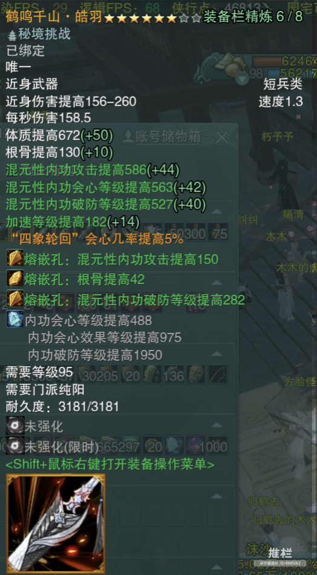​

★大橙武：橙色品质武器，需要一块大铁制作，小铁进行升级，有额外技能属性加成。

​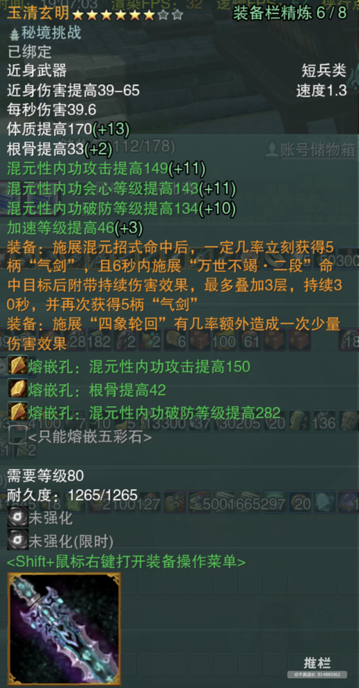​

★特效武器：具有一些特殊增益和外观的武器，一般为水特效或雷特效。

​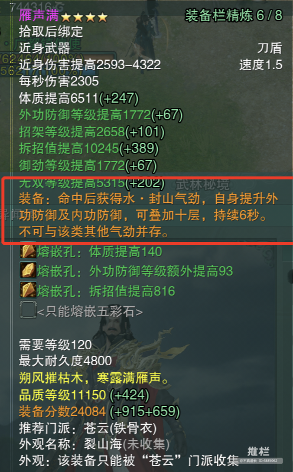​

​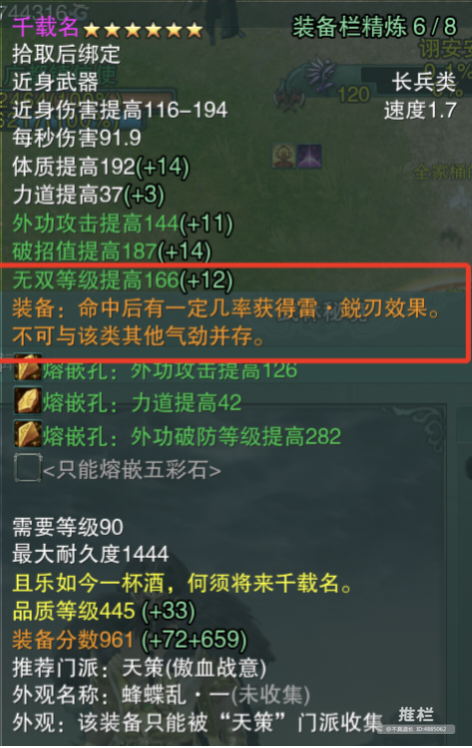​

★门派特殊武器：针对各门派出的一种武器，使用后有特殊效果。

​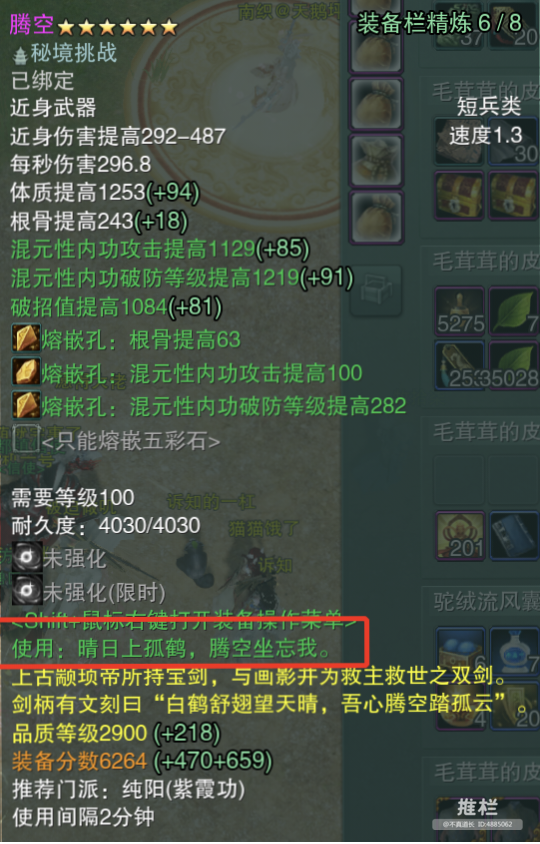​

★精简装备：针对常规装备来说，少了角色属性加成，但是绿色词条收益更高，同时所需精炼等级比常规装备少，一般为了追求极限输出使用。

​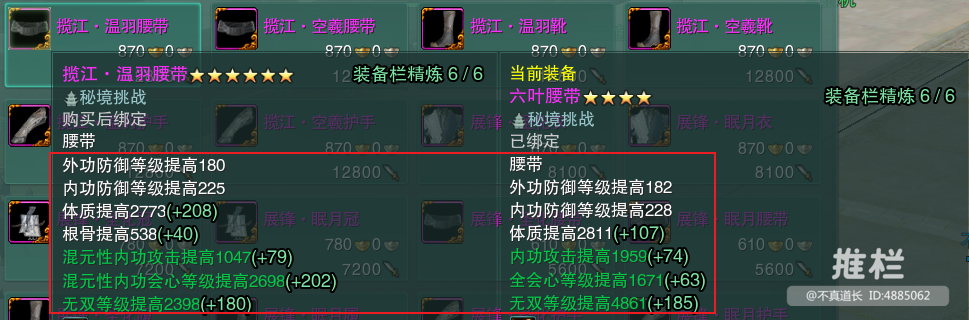​

★特效腰坠：和特效武器差不多，相比普通装备多了一个“可使用”特性，可以限时增加角色属性。

​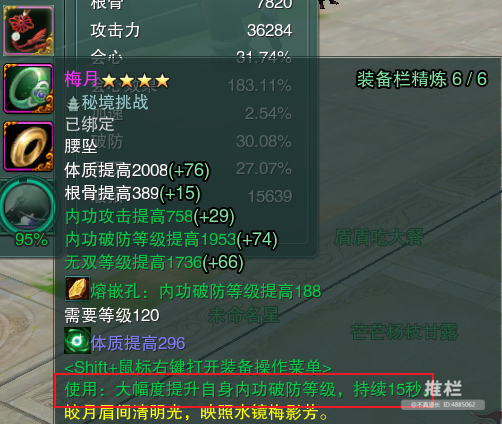​

★洞洞装：不是指装备，而是指角色的装备未经过精炼、熔嵌、强化，完全保持着装备原始属性，无任何增益。

★毕业装：指该装备已经达到或基本是当前赛季最好的装备。

## 角色属性

★属性：评价角色能力的各种指标，不同的门派心法有所侧重。属性通常又是通过角色穿戴的装备来实现，每个职业有一些属性是固有的属性，所以我们主要关注的就是附加属性即装备中的绿色词条。

​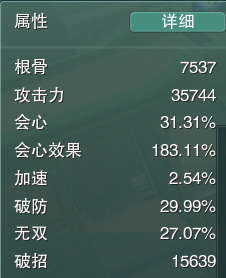​

​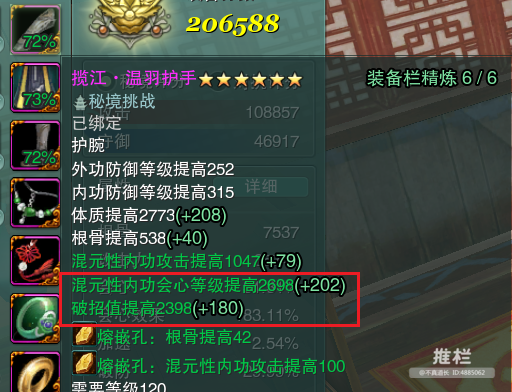​

★会无：指装备的会心等级和无双属性

★会破：常指装备的会心等级和破招

★会效：指装备的会心等级效果属性

★双会、会心会效：指会心等级和会心等级效果属性

★破破、双破：指破防和破招属性

★破无：常指破防和无双两种属性，也有指破招和无双

‍

## 区服别称

 ★天鹅坪，贴吧名为“纵月六只鹅”，小伙伴喜欢称之为“双一”或者“纵月”。

★破阵子，贴吧名为“念破”，经常被叫为“念破”。

★飞龙在天，贴吧名为“飞龙在天”，经常被叫为“飞龙”“双二”。

★青梅煮酒，贴吧名为“青梅煮酒”，经常被叫为“青梅”“双四”。

★长安城，贴吧名为“剑三电一长安城”，经常被叫为“长安城”。

★龙争虎斗，贴吧名为“电一龙虎”，经常被叫为“龙虎”。

★蝶恋花，没有别名（可能有，楼主不知道)，贴吧名为“蝶恋花”，是由电信四区合到电一的。

★乾坤一掷，贴吧名为“乾坤一掷”，经常被称为“华乾”。

★幽月轮，贴吧名为“幽月轮”，经常被叫为“电五四合一”或者“四合一”。

★剑胆琴心，贴吧名为“剑胆琴心”，经常被叫为“煎蛋”。

★唯我独尊，贴吧名为“唯满侠”，经常被叫为唯满侠”或者“鹅满侠”还有“鹅服”。

★斗转星移，贴吧名为“风雨大姨妈”，经常被叫为“姨妈服”。

★梦江南，贴吧名也是“双梦镇”，经常被称为“双梦”。

★绝代天骄，贴吧名为“梦舞天骄”，经常称之为“电八”“绝代”。又称“地狱之门”。

## 其他

★XSJ：西山居，游戏开发者。

★NPC：游戏内的虚拟角色，非玩家。

★直升丸子：系统出品，江湖神药（激活码），一粒在手，一入江湖就满级，金币到手，装备也有，适合不想做任务升级直接开始满级之路的玩家。

★宏：降低游戏入门门槛，将你的部分技能使用一个按键或几个按键就能按照设定好的逻辑释放出来。

★插件：辅助类工具，可以通过插件对游戏本身的一些设置作自定义调整。

★共战：刚刚满级玩家系统会给一个共战江湖的BUFF，可以在打副本时为团队提供增益，增加额外奖励。

★成男、成女、萝莉、正太：游戏角色的四种体型，字面意思，一个成年男女，一个未成年男女。

★日常：就是每天都会更新的任务活动等。

★周常：就是一周只能做一次的任务活动等。

★侠客：游戏中通过任务或其他方式获取的可以互动的**C。

★家园：理解为虚拟宅基地，你可以自己建房子，种花，摆放家具，等等。

★帮会：游戏玩家组织的一个团体，方便交流，活动等。

★天工树：帮会的一个技能系统，相当于玩家技能，它服务于整个帮会玩家。

★吃席、吃饭：指帮会领地提供早、中、晚餐，需要在帮会领地食用，可以给角色增加各种限时增益，在帮会领地的帮会大厅的餐桌上，进入帮会领地地图直走。

★外卖：就是在帮会领地厨房**C处购买帮会吃席的饭菜带走，在自己想用的时候再使用，只能当天食用，过期消失。

★杀猪：帮会的一个周常活动。

★奇遇：游戏触发的特殊事件，就是现实中你走路捡钱，可能一辈子没有，也可能会遇到几次，完成会给一些特殊奖励。

★阵营：游戏设定的对立团体，玩家可以选择加入不同的阵营进行对抗，用于PVP玩法。

★空气墙：一堵看不见的墙，当你发现地图一个区域没有障碍物，但是那个无法移动到该区域，则存在空气墙。

★咸鱼：不多说，两种解释，一个就是佛系玩家，一个可以网络搜索剑三咸鱼，自己领悟。

★DL:dai练,收费帮你升级，打副本，做成就，日常等活动。

★DQ：代Qing，一般不需要额外付费，上你的角色帮你打副本等，但是获取的工资收益归他，你只能获取到绑定的奖励。

★装分：指全身装备评分，团队副本一般都会有一个最低装分要求，在人物属性栏可以看到。

★毕业：一般之前当前品级的装备已经基本集齐，分普通，进阶和高阶。对应装备品级不同。

★石头：指五行石，装备熔嵌、装备栏强化用的道具，总共有八个品级，常用六级五行石。

★宝石：一般指五彩石，主要用于镶嵌在近身武器上，增加武器额外属性。

★龟甲：卦文龟甲，每周系统可能会随机赠送的一个道具，概率较低，如果信使那里有神秘的信件就是了，抓赤兔马用，不要自己取出（自己会另说），可以找马贩子，抓到分钱，过期了别扔，可以卖200金。

​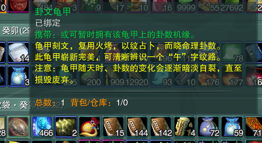​

★自觉：嘎了自己，方式很多种，说常用的几种：

       找离地面较高的地方跳下去。

       找野怪或BOSS碰瓷，你不还手。

       技能自觉经脉，初看描述，以为颠倒阴阳，神功大成，实则15秒了断。

★TS:逃shui，游戏交易行拍卖物品会有一定比例的手续费，当物品价值较高时，手续费挺可观，玩家为了避免付出手续费，选择和其他玩家当面交易。

## 货币

★通宝：游戏内部商城的通用货币，通过充值来获取，用来购买外观、挂件等。

★金币：游戏内部闯江湖通用货币，用于游戏内消费，购买装备，维修装备，买药等，通过游戏内的各种活动均可获得。

★欢乐豆：指金币。

★砖：金币单位，简写为Z，1Z=10000金币。

★飞沙令：通过吃鸡等活动获取的货币，可以换取装备等。

★侠行点：主要通过击败副本首领获取，可以换取本赛季套装，家具等。

★威名点：通过竞技场等活动获取，可以换取装备等。

★声望：与江湖势力、门派或者主城等的好感度，不同的声望等级可以购买对应势力的一些特定物品或装备。

★名望：通过行侠任务获得，不同的名望等级楚天四合令购买的物品不同。

★楚天四合令：名望货币，通过完成行侠任务获取，可以换取装备等。

★资历：通过完成隐元密鉴成就点数累计。达到一定的资历量，有特殊奖励。

★浪客签：浪客行闯关获取的货币。

★天工币：一些已经过期的材料可以兑换为天工币，在当前赛季可以兑换一些本赛季的稀有材料。

★园宅币：主要通过家园种植、日常、宠物游历、祈愿等方式获取的一种货币，可以购买家具等。

★大水南方令：主要通过园宅会赛、宠物游历等获取的代币，可以兑换一些低级装备箱等。

★师徒值：通过收徒，带领徒弟做任务等方式提升师徒值，可以在师徒商店兑换物品。

★乐游币：官方活动推出的一种限时货币，每个周期自动清零。

★PVP：玩家之间对抗，比如我们常说的PK、竞技场、攻防等。

★PVE：玩家与游戏设定控制的一些怪物或者首领进行对抗。

★PVX：PVX就是休闲玩法，在游戏中指休闲玩的一群人，可能什么都玩一点可能什么都不玩，主要图开心，也就是休闲、风景、外观党玩家之类的统称。

★挖宝:就是寻宝，消耗40点精力在某个地图搜寻宝物，挖宝随机产出材料、宝箱等。

★藏宝洞：寻宝随机开出或者使用，藏宝图开出的一个限时秘境，通过以后可以得到装备特殊材料等。

★团点：组队情况下寻宝到40次的时候，必出一个宝藏点称为团点（也可能不需要40次）。

★打手：一般是自己挖出来了藏宝洞，自己单人无法通过花钱请人帮忙通过。

★JJC：竞技场缩写，游戏里实际是名剑大会，在主城战场区域报名进入。

★22，33，55：竞技场模式选择，竞技场有2人组队，3人组队和5人组队PK

★吃鸡：绝境战场，江湖版吃鸡，战场区域报名进入。

★大战：日常中的一个5R副本任务，可在主城公告栏或帮会公告栏接取，完成后会给额外奖励。

★单刷：自己带侠客或者自己独自通过副本或者多人参与的活动。

★茶饼：用于茶馆喝茶碰瓷侠客奇遇，110级以后每天可以在客栈老板娘处领一个限时绑定茶饼，茶饼还可以通过周常本、当赛季主流本概率掉落，还有活动赠送等方式获取。

★茶馆：游戏内一个特殊的日常任务点。

★维峰丹：可以快速提升侠客等级的一种丹药。

★浪客行：一种闯关玩法，可以单人或者多人一起，人数上限5人，在各主城找浪客行接引人进入，有自己的装备或物品体系，每通过一个关卡了获得一定数量货币，每周有获取上限，可以使用货币换取装备等。

★客栈：浪客行内的一种特殊地图，可能触发奇遇。

★百战：百战异闻录，一种闯关玩法，有自己单独的技能体系，通过闯关可以获取特殊掉落物品。

## 副本

★秘境、副本：常规指需要多人组队协作才能通关的一个地图。

★5R、10R、25R:副本简称，指一起挑战副本的上限人数，玩家队伍不能超过这个人数，可以少人(人少了，物品掉落可能也会影响)，团队副本指10人和25人副本。

★PT,YX:一般指副本难度，普通难度和英雄难度。

★25PT：指25人普通难度副本，其它类似。

★团长、队长：五人成队，两队以上则成团，队伍或者团队的组织者为队长或团长

★飞本：到当前副本入口。

★黑本:第一个进入副本，这是玄学，有的人运气好，BOSS就可能会掉落一些特殊物品等。

★黑CD:只一个副本没有通关，因其他原因无法继续，造成CD浪费。

★一车：完整的通过一次团队本。

★翻车：副本与BOSS战斗发生团灭，或因其他原因造成该次副本活动无法继续进行。

★修车：副本BOSS没有打完，中途因为各种原因散伙，再次组人进行余下BOSS的战斗。

★跳山，跳房子：不走寻常路，主要为了绕开一些小怪，或者走捷径，需要使用江湖轻功等灵活处理。

★OT:队伍成员因伤害输出或治疗输出所造成得仇恨超过了T对其目标所积累的仇恨值而使目标放弃T转而攻击该成员。

★小铁：一般是指XX陨铁，做大橙武必备。

★小包：副本BOSS可能掉落的小铁已经被预定，其他人无法竞拍。

★大铁：XX玄晶，做大橙武必备。

★大包：副本BOSS可能掉落的大铁已经被预定，其他人无法竞拍。

★小包大拍：指小铁已经提前预定，大铁如果出了则通过拍卖的方式。

★小2大8：针对当前赛季主流本来说，小2一般指小铁2000一块提前预定,大铁8000RMB提前预定;针对其他团队副本来说，小2可能指包全程小铁，大铁8Z包，具体看招募描述。

★牌子：门派校服套装兑换道具，一般总共五件，集齐两件和四件的时候有额外属性加成。

★沙子：每个赛季切糕武器的必备材料，团队英雄本概率掉落。

★散件：除了牌子之外，BOSS掉落的装备。

★武器盒子：BOSS掉落的武器，可以开出自己角色当前心法的武器

★135起拍：指物品购买最低价格，一般常用于赛季刚刚开始，常规指散件1000起，牌子3000起，武器5000起（有时候也包括精简）。

★P：指PASS，不要的意思，当你觉得当前竞拍价格已经超出你的预期，你放弃竞争时打P。

★P价：指出现相同物品之后，上次玩家Pass的最高价格，从该价格起拍。

★打工：你的装备已经符合副本要求，去参与BOSS战斗，最后输出或治疗等达到最低要求，最后获取收益分成的玩家。

★黑工：团队副本每周有次数限制，当你当周已经达到次数限制，通过重置再次跟团进入副本，自己无法拿到BOSS掉落，同时有可能影响整个团队掉落。

★工资：参与副本的BOSS战斗，最后团队收益分成。

★罚款：指在副本BOSS的战斗，因为你的原因造成团灭缴纳的资金。

★坐牢：指已经花费了远超过常规通关副本的时间，仍然未通过该副本。

★演员：常指因一些低级错误导致自己重伤或灭团的玩家。

★熟练、熟手：已经基本熟悉当前副本BOSS的打法机制。

★补贴：一般指玩家在团队里承担了本职业额外的工作，从团队收益里分出一部分补助该玩家。如TN补就是指T和治疗有额外补贴。

★私补：除了工资之外，团长给予额外的金币补助，一般是T或者治疗。

★包团：花费一定金币，如果BOSS出了你的职业装备，直接归你（散件是否包含，需自己确认），你可以不用参与战斗。

★XX扫地：指BOSS掉落物品有需求的已经拍卖完剩下的装备、材料等的所有权，不同团规则不同。

★老板：进行小包、大包、包团、包材料等的玩家，也可以参与战斗赚取工资。

★金团：就是专门负责副本活动，招募老板赚取工资的团队。

★野团，散团：直接从世界招募玩家组成团队进行副本活动。

★亲友团：团队大部分玩家都是好友，如果不足可能招募少量世界玩家进行副本活动，很多时候都是带亲友熟悉副本或者追求特殊掉落等。

★教学团：团队部分成员可能未打过该副本，团长会详细介绍该副本BOSS技能、注意事项等。

★速刷团：追求副本通过效率的团队，基本都要求熟手，指挥一般只在比较关键的时候做提示，不会讲解BOSS怎么打。

★眼神团：要求熟手，没有指挥，需要自己完全了解该副本的打法机制，自己躲避技能等。

★成就团：主要是为了副本中一些比较挑战性的目标。

★躺拍：字面意思，躺着购买东西，相当于不参与对BOSS对战，只参与物品的购买。

★抵消、低消：消费金币的最低要求，例如低消1Z，就是指这次副本你至少需要消费1Z金币来购买装备或者材料等，如果消费不够需要补足低消额度。

★低保：指通关当前等级10R或者25R秘境后，可以拿到一个装备箱子，可以开出一件符合当前心法当前副本掉落品级的装备。

★共免，共免躺：就是指有共战BUFF的玩家可以去团队副本，可以不参与BOSS战斗，参与BOSS掉落的物品购买，无低消要求。

★面向：指角色或者野怪BOSS的正面扇形区域，很多时候其实也就是指视野范围，当野怪或者敌人在你的面向里你才能攻击。

★躲面向：这里的面向常规指副本BOSS的面向，因为很多BOSS是面向范围伤害，你站在BOSS面向也会受到伤害，一般除了T，其他DPS和奶妈常规要求背后或者侧面输出。

★穿面向：指你当前位置在BOSS的面向区域内，然后直接移动到BOSS背后。

★点名：指你被BOSS的暂时指定为技能释放目标。

★集火、转火：按照指挥要求，全部攻击同一个BOSS或小怪。

★脱战、拉脱：脱离战斗状态，离开BOSS一定距离，退出战斗状态。

★引导：常指引导BOSS释放技能的方向或者区域。

★挡线：常规指副本BOSS指向性技能伤害，需要玩家持特殊道具或BUFF站在BOSS与点名玩家或者**C的连线中间来抵挡伤害。

★驱散：使用驱散技能驱掉BOSS给玩家释放的负面状态。（PVP指驱散队友的负面状态）

★打断：使用打断技能打断BOSS释放的特定读条技能。

★减速：使用减速技能降低BOSS召唤的小怪移动速度。

★枯XX：药宗治疗技能[枯木苏息]，一个战斗复活技能，可以让重伤的玩家起来继续战斗。

★杯XX:长歌治疗的战复技能[杯水留影]，可以让重伤玩家起身战斗30秒。

★凤凰：[凤凰蛊]，五毒治疗的复活技能，提前释放给玩家，玩家重伤后，可以立即复活。

★战复：七秀治疗的战斗中复活技能[心鼓弦]。

★龙葵：[龙葵自苦]，药宗治疗的一个群体减伤加盾技能。

★给盾:[梅花三弄]，长歌治疗的一个单体减伤技能。

★袖气：七秀技能[婆罗门]，群体增益状态。

★落无敌、下山河：气纯技能[镇山河]。

★挂扶摇、补扶摇：江湖轻功[扶摇直上]，下个BOSS技能需要跳跃躲避，提前使用扶摇技能，使用后别按跳跃按键

★站点：队长给在地面放置一些数字记号，你需要站在指定的记号处，例如站1号点，你就去找1号标记就行。

★出人群：就是远离其他玩家，别站在一起。

★回人群、抱团：靠近其他玩家，站到一起。

★远离：BOSS的AOE技能或者其他玩家或自己中了一些群伤DEBUFF，你需要远离一定距离才能躲避，一般都有特殊颜色标识。

★滞空：就是在空中停留一段时间，这个主要通过扶摇配合小轻功实现，常用循环：[扶摇]到最高处后，接二段跳，在用[左/右/后跳]中的一个小轻功，再二段跳，然后落地。

★跑圈：BOSS出的AOE技能，地上会有标识，你需要躲开。

★跳环：BOSS的AOE技能，从某一个位置向外扩散的环形技能，你需要通过跳跃等方式越过环形区域就好。

★后跳：BOSS技能机制，需要后跳规避伤害，有三种方式①后退键按住，再按跳跃键向后跳;②[迎风回浪]技能;③如果在地面可以使用[后撤]技能。

★承伤：BOSS的AOE技能，需要多名玩家站在一起分摊伤害，一般是浅黄区域标识。

★下P：BOSS血量到达不同百分比，BOSS释放技能发生变化。

★挖Kuang（敏感）：就是因为目前的调节，副本暂时无法完全通关，只选择可以打的首领。

## 百战

★精耐：精力、耐力，百战活动必备的两种角色属性，因为百战内的技能需要消耗精力或者耐力才可以进行释放。

​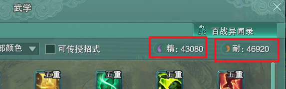​

★补精耐：，不同阶的BOSS有一个角色的精耐要求，假如打40关需要精耐1W1，但是你的精耐不够，当队伍里其他玩家的精耐超过该数值，超过的数值就可以补到你的精耐数值上来计算使之达到关卡要求。

★打精、削精：百战每个BOSS都有精力，精力会给BOSS回复耐力，我们通过技能消掉BOSS的精力，称之为打精。

★打耐、削耐：百战BOSS初始有固定耐力值，耐力值会给BOSS降低伤害，我们通过技能消掉BOSS的耐力，称之为打耐。

★一阶、二阶等：指BOSS的难度等级，没10关BOSS升一阶，升阶后通关难度增加，BOSS也会增加额外伤害机制。

​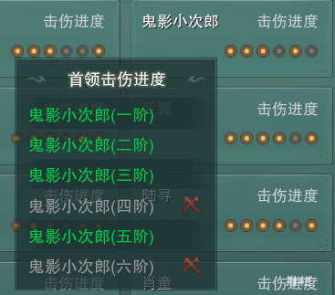​

★一重、两重等：指百战技能等级，等级越高对BOSS造成的伤害越高，技能重数可以在技能图标的右上角查看，一般技能高于三重会有额外效果，具体查看技能描述。

​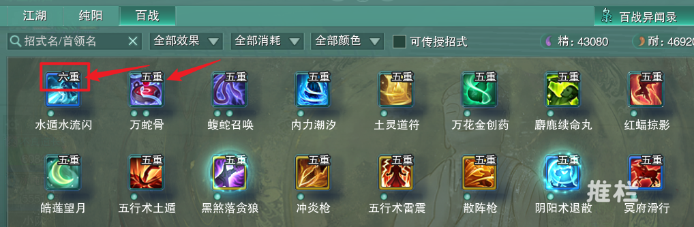​

★宝宝车、婴儿车：相当于副本的教学团，主要针对没有玩过百战或者精耐不够的玩家进行百战活动。

★30-50：当前赛季百战总共有60关，30-50指在百战的30-50关内选择BOSS进行通关。

★婉拒444：指拒绝技能都是四重（包含四重）以下的玩家，打高阶BOSS时，技能等级不够会比较费时费力。

★黄破、红破等：游戏界面出现不同颜色提示，这时候如果对BOSS使用相同颜色的技能可以造成更多的伤害。

★黑煞：百战技能【黑煞落贪狼】，常用输出技能。

★天诛：百战技能【一闪天诛】，当前赛季常用输出技能。

★阴阳：百战技能【阴阳术退散】，当前赛季常用输出技能，可以驱散，打精。

★疾走：百战技能【疯狂疾走】，当前赛季常用输出技能。

★飞刀：百战技能【飞云回转刀】，主要用于BOSS打精。

★滑行：百战技能【冥府滑行】，需要一点点操作技巧，高伤害技能。

★帝骖：百战技能【帝骖龙翔】，女性角色专用技能，打精控制技能。

★花钱：百战技能【花钱消灾】，打精技能，对自身金币有数量要求，不然无法达到技能效果。

‍
