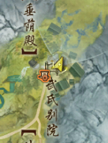
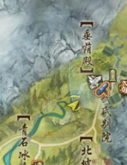

# H13 截图攻略

孤僻星

药宗真的好美！

欢迎投稿，支持原创，尊重版权，热爱药宗！

本篇有大量转载，侵权速删。

联系方式：电五乾坤一掷-孤僻星星-Q：2731155821

---

特别致谢 [暮松大哥](https://www.weibo.com/u/3865586393) [桉之之 ](https://space.bilibili.com/13459207) [Kerlap](https://tieba.baidu.com/home/main?id=tb.1.e8d0dbf1.VhKgb1pAG1k3GTB1gGkr9g?t=1707218514&fr=pb) [浅色梦境](https://tieba.baidu.com/home/main?id=tb.1.e0656209.7sLnzH4lHfjsTtaQcHEdpQ?t=1679410690&fr=pb) [阿波崽](https://tieba.baidu.com/home/main?id=tb.1.2c5216a0.trPczz1lyIb9z01iyU770Q?t=1694273036&fr=pb)

# [暮松大哥](https://www.weibo.com/u/3865586393)

暮松大哥的图文版截图攻略

“山中何事？松花酿酒，春水煎茶。

——这是一期古画感水墨山水截图教程

​​

​​

​​

​​

​​

# [桉之之](https://space.bilibili.com/13459207)

## 【剑网3】截图教程|北天药宗| “一条帘卷窗前月，几点星摇树里天 ”

https://www.bilibili.com/video/BV1BL4y1n7nt/

‍

## 【剑网3】截图教程|北天药宗| “蝴蝶不传千里梦，子规叫断三更月”

https://www.bilibili.com/video/BV1Yu411m7NA/

# [Kerlap](https://tieba.baidu.com/home/main?id=tb.1.e8d0dbf1.VhKgb1pAG1k3GTB1gGkr9g?t=1707218514&fr=pb)

1.北天药宗长白山传送点  
推荐理由：纯白色背景，巨出片，证件照的不二选择

​​

2.依然是北天药宗的瀑布  
药宗有很多这样的溪流瀑布，随便选一个也有这种效果  
推荐理由：适合蓝白色外观，加上景深会有波光粼粼的感觉

​​

3.北天药宗阿占特部落  
推荐理由：很适合最近出的藏袍，还有一些拓印  
要点：我截图的点有两头鹿，不远处的山坡上还有一头可以站着截~坐着的动作是排排坐

​​

4.北天药宗去疾院  
推荐理由：极致画质下，整个院里都是雾气绿茵，一定要等起雾更美~我截图的点前后都有断壁残垣，两个方向都适合

​​

5.北天药宗神农苑  
推荐理由：如果有闲心的万花一定要来，紫色瀑布一样的树垂下来，适合一切紫色的外观，景深设置好了，加一些光效更美

​​

6.北天药宗白河村向日葵田  
推荐理由：网红打卡点了，萝莉正太体型更出片，推荐前景后景都运用

​​

7.北天药宗神农苑  
推荐理由：这块小花圃很多颜色，除了黄色的花还有粉色玫红色的，非常出片~

​​

8.北天药宗白河村屋顶  
推荐理由：这个点是源于我无意中跳上去，人物看向天空的一瞬间，觉得非常美，想截横图做登录背景的，比较主观。感觉坐着拍应该也很有感觉。

​​

9.北天药宗天池花海  
推荐理由：这也是一个网红点，适合一切颜色的外观，因为你可以找到任何颜色的花花~

而且这里还有鹿群，出镜小怪很可爱！

​​

卡动作最喜欢的一张，不知道大大是如何做到的

​​

‍

# [浅色梦境](https://tieba.baidu.com/home/main?id=tb.1.e0656209.7sLnzH4lHfjsTtaQcHEdpQ?t=1679410690&fr=pb)

地点：北天药宗武氏别院南侧台阶下  
动作：金盏琉璃灯+眼神焦点

​​

# 其他（主要来自[阿波崽](https://tieba.baidu.com/home/main?id=tb.1.2c5216a0.trPczz1lyIb9z01iyU770Q?t=1694273036&fr=pb)的帖子）

https://tieba.baidu.com/p/7604918956

天池旁边

​​

天池附近的岸边儿

​​

就是陈月前面楼梯下面

​​

​​

有雾气和好多垂下来的藤曼的地方

​​

​​

​​

垂荫殿

​​

**在药宗的百会阁神行点往左上方向的山谷里！茗伊坐标88582,49597,1926528**

​​

**在药宗大战神行点往山下方向的那个楼梯那儿**

​​

一个可以和NPC合影的地方  
在陈梦麟的神农苑

​​

**谷口遗址，在中间那个洞里**

​​

葛芊芊站的那个屋子房顶

​​

网红天池打卡【游客照】

​​

**谷口遗址！红白树那个**

​​

​​

完颜祭，还有那个部落

​​

​​

日常任务那颗大树旁边！！超有动漫质感

​​

地图有个怪杀了有成就那个树林

​​

神农苑的花架！站在草棚顶上然后背对就行了！

​​

药宗的谷口遗址！有根柱子上有两只肥啾，还会躺下晒肚子，太可爱了

​​

​​

药宗的大战本！武氏别院内

​​

# 远景

​​

​​

​​

​​

​​

# 卡动作教程

环境云图可以在动作进行中进行定格

注意，只能定格自己角色的动作，例如药宗的收剑动作，技能读条

推荐：当归在空中，枯木跳舞中，银光出刀中，凌然上天中

​​

​​
