# H5 进阶提升（25yx）

# 〇、 约定

首先，抢治疗量不是为了出警其他玩家，请仅与自己对比，以提高自己的操作水平。

1. 本篇默认读者已熟练掌握基础循环，并对灵素技能、奇穴有所认知，主要面向有目标打25英雄难度副本并取得较好游戏表现的读者。
2. 阅读本篇时，奇穴必须满足：  
    点畅和：“灵素中和”效果还会对作用目标附近6尺额外1个团队成员造成治疗效果，且其在“千枝绽蕊”期间作用人数额外提高3个并不会产生威胁值。

    点飘黄：“逐云寒蕊”不再产生隐匿效果，使得“逐云寒蕊”10尺范围的团队成员施展伤害招式附带一段额外伤害，该伤害无视目标100%的防御，最多每1.5秒触发一次，持续10秒，该效果在60秒内只能享受一次。

    点同梦：“龙葵自苦”调息时间提高40秒，对目标10尺内最多25个目标生效，最大吸收量降低为目标最大气血值的50%。

    点卫矛：“枯木苏息”效果自身不再沉睡，但使得自身救治的友方目标获得气血最大值500%的治疗吸收盾。
3. 本篇技能读条都基于加速四段（韶时0.81s），满加速另做讨论。

联系方式：电五乾坤一掷-孤僻星星-Q：2731155821

机制研究，见[应无骞](https://www.jx3box.com/author/72859)：https://www.jx3box.com/bps/36054

---

首先，药奶被公认为，持续性掉血治疗乏力、无贯体治疗，实战如图

​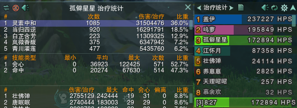​

因此为了进一步提高自己的有效治疗量，

# 一、进阶思路

1.首先熟练基础循环和爆发循环分别是什么，在对应的情况要能从容不迫打的打出，而不是一着急技能乱丢甚至打出满寒七情这种操作。

2.每打完一个本甚至一个boss，都要去复盘自己哪里打的不好，比如最好找的问题就是某波大掉血自己手里有没有技能？为什么没有？

3.要关心自己的技能数，银光的使用率如何，分均中和有多少，**我个人**并不认同不掉血就不用刷中和或者不看中和数这种说法，一是配伍的增益要通过中和来生效，二是能奶的高的中和数并不会低。我把分均中和粗暴简单的分为四个阶段（紫武）：60（入门）-80（熟练）-100（路人高手）-120+（一手玩家）。-----（当然只是用于大概评判，毕竟一键宏也能分均100了，所以只是一个很简单的参考）

4.当自己技能数够了，发现为什么还是奶不过别人可能有两个原因，一是遇到的其他奶妈也确实很厉害属于职业差别，有些掉血模型药奶确实乏力，二是装备差距，是不是自己的装分太小或者加速不够或者会心过分低都有可能决定hps的高低。

5.当技能数够装备也够了发现自己基本都能奶第一了，就要去细化技能轴，卡好boss掉血技能的时间去打循环，以此拉开hps的差距，不仅要第一还追求拉开差距。

6.合理分配你眼睛能看到的东西，如果一直关注在药性条来打循环，盯着团队面板来刷血就会丢失一些细枝末节的东西，比如有人掉血了你对他读了当归但是他距离你很远，走了两步就拉断了你的当归，这个我相信很多人都遇到过，那么我们就要试着把注意力也放到游戏场景中去，看谁可能拉断你的当归或者谁可能吃不到龙葵而要掉血单点。那么我推荐可以试试药性心算而非盯着药性条打循环，在我刚玩药奶的一段时间里，我的注意力几乎一半都在药性条上，极大限制了我对其他东西的关注。

7.当自己能拉开差距了，我们再试着去拉开虚条差距和奶断层，这需要把很多小细节做好，比如某些卡秋风的唐门站在犄角旮旯里吃不到溅射要想办法提前单点他或者有些贪dps不躲技能的人提前关注他诸如此类。

‍

# 二、实战技巧

1.**白芷**和**赤芍**都要学会预读条，例如已知某目标即将掉血，可提前挂赤芍预读白芷来抢hps

2.大部分“幻歌”跳圈都可用**二段跳+当归**的方法来规避逃课

3.**七情**尽量在0或1药性下使用最合算

4.**龙葵**要学会选中自己使用，你可以站到大团中间保证你是技能范围的圆心，以此覆盖所有人，而不能盲目选择近战/远程一人导致只有半个团吃到

5.**青川濯莲**可以移动释放，双击地板不选择目标时可以手动选择释放位置，尽量释放在人群中间

6.“**飘黄**”同龙葵，你要站到人群中去释放，保证所有人都吃到

7.**枯木**可以重复打断释放，当两个距离目标过远，可以每个人卡20尺的极限距离尝试在两者连线的中间是否能拉到

8.**枯木**选到的目标身上有绿色光柱，注意观察，不要盲目释放

9.“**妒茵** ”可简单理解为双当归，全团掉血要学会选择的目标和自己尽量不重叠，如自己站远程堆目标选近战堆

10.善于利用**龙葵**所附带的治疗效果，当成一个群体小抬，如武狱黑牢老二“迦楼罗腾闪”中可以释放

11.善于利用**凌然天风**带来的三次瞬发白芷，紧急时刻可挽回血线

12.**当归四逆**会被目标拉断，不要选择会乱跑出范围的人

13.**银光照雪**要好好使用，不要范围内没人就放了，该技能治疗系数极高

14.“**千枝绽蕊**”状态下有减伤减仇

15.善于利用**凌然天风**状态下带来的五尺释放距离

16.“**鬼卿**”修饰的当归四逆每跳都附带驱散效果

17.温流下如何打出高质量的岚赤当赤需要自己去记忆boss的时间轴

## 手法

这赛季的药性变化的比之前快，之前我们打常温，不用担心寒溢出，因为寒永远不够用，除非停手，现在多了俩回寒的，得自己注意药性，不要浪费。

败叶莲花+5寒，岚微+5寒，如果这俩一起用，会+10寒，那你决定这俩组合用，要小心寒溢出，两种处理，一种是多温起手当归+白差不多中和掉，一种是寒起手用七情中和掉。

在实战中不用执着当赤，当你发现你寒溢出的时候就直接白，温溢出就优先赤，就把白赤当砝码，平衡药性的工具，面多加水水多加面。

有两种思路：  
一种精准排轴，适合固定轴+瞬间爆发，把技能分配好，每个技能有多少寒温自己提前做好计算，中间该用什么技能自己提前算好，计数按表来，这种我不推荐，太死板了 ；比如只炸一波的aoe（老六单鸟），要把治疗打到一个点，溢出少（一瞬间）就银光七情和落子拼手速；比如炸一波但是溢出多（3-4s）（提前卡时间败叶）银光岚微当归+七情收尾，这里注意如果点的忘忧这个组合最好温起手，如果点的败叶最好满寒起手开抢，这样最后一个七情才能接近满药性。

一种排大轴其它随机应变，适合非精准固定轴，第一优先排好龙葵轴，其它大加简单排一下顺序，根据伤害出现的时机打技能，比如说老六驱散，大时机你是知道的，但是奶歌具体驱散的瞬间无法把握，其它奶妈的技能顺序在越野时也无法得知，大概排出来银光败叶莲花——岚微当归——龙葵——银光七情收尾  ，看到秒落子的就可以平奶大加延后到下次使用，看自己的药性变化，灵活一些，寒多了就纯白不赤，温炸了可以提前七情，

至于长期持续掉血，比如说老一持续刷血，这两种操作区别不大，龙葵起手or败叶莲花起手——莲花（如果龙葵起手）——当归岚微——中间温满了可以看血线炸个七情——当归——当归岚微——莲花（如果莲花起手），中间白赤填充。

几种可选爆发组合（只说大轴默认开花）：

1、瞬间满血：银光七情和落子拼手速

2、有效治疗时间3-4s：（提前卡倒数败叶）银光岚微当归+七情收尾，这里注意如果点的忘忧这个组合最好温起手，如果点的败叶最好满寒起手开抢，这样最后一个七情才能接近满药性

3、有效治疗时间5-10s：（提前卡倒数败叶） 银光莲花——岚微当归——龙葵——银光七情收尾，一般是温起手，中间看情况补药性然后七情收

药奶的特色就是多个短cd小爆发：七情、岚微、当归、败叶、（龙葵），通过小爆发的组合应对多种掉血情况，高强度长间隔aoe组合交，低强度短间隔aoe错开交，它没有落子那种大爆发，也没有覆盖率高的hot，优点和缺点都明显。

我认为药奶是很灵活的，对自己有什么技能大概心里有数，知道aoe来了有哪几个技能可以组合，排轴分配好资源，别的随机应变，算死轴只会算死自己。

‍

# 三、抢治疗量（实条）

先放图，奶妈的治疗量是要抢的

老话说的好，好记性不如烂笔头，请在魔盒上查看副本攻略，打前快速看一遍，做到胸有成竹。

​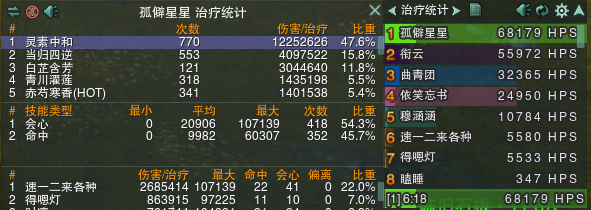​

​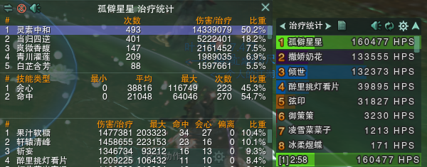​

​​

## 什么是HPS实条、虚条与总条

          HPS统计（无论是实条还是总条）计算的只是全程战斗的平均值，然而，并不是每一点HPS价值都是相等的，例如垃圾时间的治疗量价值就远不如高压期的治疗量或者队友突发残血的一口救急大加。因为垃圾时间并不是完全不掉血，也会有断禅语或者一些毛毛雨的伤害，能产生实条HPS，当一个BOSS的垃圾时间时长远远超过高压期时长，累计起来的垃圾时间HPS，就足以稀释掉高压期HPS的价值。因此，比起全程HPS统计，我们更需要阶段性HPS统计，能自行选择战斗中的某几个时间段进行HPS统计，而将垃圾时间的HPS进行舍弃。

        尽管我们可以通过自行清空HPS统计来进行某个时间段的HPS统计，或者使用录屏事后反推战斗过程中某个时间段产生的HPS（具体方法可见我前一个帖子），但这些方法都比较繁琐，分析一场两场战斗可以，战斗场次多了分析起来就很麻烦了。

         奶妈在垃圾时间里交技能的积极程度也会很大程度上影响总条HPS，例如，对于HoT奶来说，即便团队不掉血，维持的hot人数越多，总条HPS也会更高。这也导致，即便你在团血高压期提供的治疗量没那么多，但是你通过垃圾时间里依旧不停手，甚至开爆发交大技能，你的总条HPS可能仍然会比较好看。反过来说，如果你在团血高压期提供了非常足量可观的治疗量，但如果你在垃圾时间里停手不奶，你的总条HPS可能也会上不去。

        相比系统自带的战斗统计，茗伊插件战斗统计最大的优势就是可以同时显示两个条（一个条不透明，也就是实，一个条半透明，也就是虚），如图所示，这是每一个治疗玩家都很熟悉的界面了。

​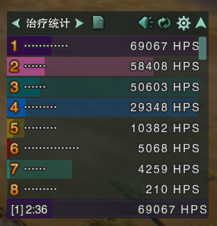​

         战斗统计中的“实条”代表有效值，这一点大家都很熟悉。而关于“虚条”，很多人倾向于把后半段半透明的条定义成“虚条”，即“虚条”代表数据的无效值部分。“实条”和“虚条”似乎是头尾拼接的关系。然而实际上两个条之间的关系并不是这样，其实HPS面板上显示的是一个实色的条“悬浮”在虚条之上，覆盖了虚条的前半部分形成的。翻看茗伊插件的源代码，可以发现也确实是这么写的。茗伊创建了fore和back两个图层分别位于前方与后方，对应实色条和虚色条，前方的实条用的数据就是有效值，而后方的虚条是用了数值的总值。如下图所示，就是两个条的显示方式。

​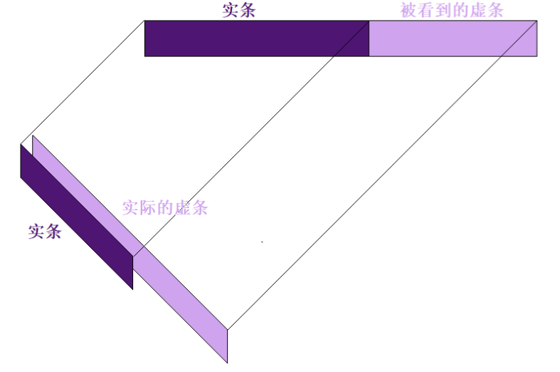​

         当然，关于虚条到底应该指的是哪一段的问题，只是个概念和观念的问题，对于实际数据的认知理解并不会产生影响。在这篇文章中，我主要想要讨论的还是茗伊插件里定义的“实际虚条”，为了统一概念，同时也不与很多人一直以来的“虚条”概念相混淆，我们把它称为“总条”。其实按照茗伊插件里的原始定义，我们更应该把实条叫做前条(fore)，总条叫做后条(back)  ，不过这样可能有点抽象了。

因此，实条代表有效HPS，总条就代表总HPS，总HPS等于有效HPS+无效HPS。

（PS：这里还需要补充一点关于广义“有效和无效”的概念，有的时候战斗中即便能进入实条统计的数据也未必是有效数值，例如大针无中生有的HPS，而没进入实条统计，甚至没进入战斗统计的数据也未必就是无效数值，例如蛊惑或者平摊类治疗传递的治疗量。包括龙葵作为治疗吸收盾被移除的治疗量，枯木苏息战复后的治疗吸收盾，都不会被战斗统计记录，但本文不会对这个问题进行进一步讨论。）

龙葵什么时候加入治疗统计！！！

‍

## 对轴+龙葵的正确使用

以下方攻略为例，可以自己寻找攻略学习，在正确的时间已知某目标即将掉血，进行治疗，能得到更高的实条，这需要不断练习。

> # 老一
>
> ### 奇穴
>
> ### 打大莲花，不染素柯晴柔莲池
>
> ​​
>
> **仅限pt，正式服开荒yx还是换回正常决明开荒**
>
> **pt掉血量不高，个人整个老一只触发了6下决明，决明触发率非常低，收益来看，现在体服pt决明是没有什么必要的，建议7换晴柔，但7晴柔的占比也很抽象，高达2-3%，怎么不算有提升呢，败叶玩了感觉也一般**
>
> ### 斩海
>
> AOE+20s持续掉血，轮次最开始的两次斩海间隔只有32秒，其他斩海间隔都很长，安排好治疗技能
>
> 除此之外安排好龙葵位置
>
> #### 龙葵位置——斩海时间间隔循环（注：指的是boss释放技能间隔，如果要算后续持续掉血时间，自行32s-20s持续掉血）
>
> 开始时间不完全正确，间隔是确定的
>
> 斩海1——1分06秒
>
> **间隔32秒**
>
> 斩海2——1分38秒
>
> **间隔103秒**
>
> 斩海3——3分21秒
>
> **间隔134秒**
>
> **重新一轮循环**
>
> 斩海1——5分36秒
>
> **间隔32秒**
>
> 斩海2——6分08秒
>
> ······
>
> 由于斩海1与斩海2间隔只有32秒，实战只能选择其中一个斩海给龙葵，分为以下情况
>
> 打法1：斩海1给龙葵
>
> 打法2：斩海2给龙葵
>
> 打法3：其中一个斩海给无敌（依然有持续掉血，但是少了最开始的AOE，仅有dot掉血更容易保奶歌盾），另一个斩海给龙葵
>
> #### 药奶打法
>
> 非败叶前提，斩海1斩海2间隔32秒，莲花排轴非常尴尬
>
> 个人选择斩海1吃过半莲花，斩海2吃全程莲花
>
> 一轮斩海20秒dot能塞两个当归，但建议
>
> 药奶技能释放时间
>
> 第一个斩海，dbm倒计时8秒读条，种提前莲花，可以吃6-7跳
>
> 第一个斩海给龙葵，20秒掉血期间自行安排1个当归，建议在流血倒数15-13秒释放
>
> 分类讨论
>
> 第二个斩海读条同时，莲花CD转好，立马放，可以吃满9跳
>
> 第二个斩海AOE，寒当瞬抬，正常群抬治疗，第二个当归CD转好就放
>
> # 老二
>
> ### 奇穴
>
> 妒因素柯岚微
>
> ​​
>
> ### 香风——迷香——风起云涌
>
> 同10人，香风点名后附带迷雾buff，额外附带风起云涌易伤，易伤会叠层数
>
> 处理方式：找3个人站最远排香风，安排驱散，药奶可以提前给龙葵保盾
>
> 一轮循环总共有两次香风，建议给第二次香风（带着第一次香风的易伤）
>
> ### 归潮——风起云涌结算
>
> 归潮结算风起云涌易伤，6尺内伤害最低，风起云涌层数高的需要进6尺防暴毙
>
> ### 蝶雨——蝶雨持续
>
> 期间boss99%减伤，pt变成20秒倒计时，抱团跑圈，或往外圈散自由搏击
>
> #### 药奶打法
>
> 莲花CD很重要，如果想让每一轮蝶雨和归潮AOE都带莲花，都需要提前5秒放莲
>
> 延迟一次放莲，可能会导致后面莲花次次都跟不上，优先保证蝶雨莲花
>
> 蝶雨20秒持续蝶雨强刷前提
>
> 主要由寒当——岚微——当归——收尾七情组成，药奶如果贴人近，银光占比也很可观（）
>
> 预读莲花
>
> 20秒持续共能转好两个当归，第一个当归需要在蝶雨持续dbm倒计时16秒前释放，否则收尾当归CD转不好
>
> dbm倒计时持续16秒前使用寒当——正常治疗——岚微正常读条白（注意岚微位置尽量往人多地方放），溢出则凌然瞬发白——当归CD转好当赤——收尾七情
>
> 归潮AOE
>
> 在龙葵不保香风情况下，龙葵可以单纯用作归潮瞬抬治疗，具体操作为
>
> 药性转温-归潮同时岚微+龙葵，造成龙葵群奶+龙葵中和+岚微后续中和
>
> # 老三
>
> ### 奇穴
>
> 妒因素柯岚微
>
> ​​
>
> boss身上显示宝石buff下一颗是什么宝石，提前看地上初始宝石位置  
> [狂躁的诺布心决内力]，3层吃璀璨/星驰结算必死  
> 竞速选第一轮红3消和第2轮吃应该就行
>
> 内伤持续掉血来自宝石掉落砸下来的伤害，只要不吃就没有持续掉血
>
> #### 老三轴
>
> 标红为重点AOE
>
> 26s——红宝石3消抬血（这个是必吃的）（可以龙葵）
>
> 52s——绿宝石3消抬血（可以考虑不吃）
>
> 62s——蓝宝石3消抬血（可以考虑不吃）
>
> 1分01s璀璨读条
>
> 1分05s璀璨3次AOE
>
> 1分55秒红宝石3消抬血（可以考虑不吃？
>
> 2分15秒星驰心狐分散
>
> 2分44秒璀璨读条
>
> 2分49秒璀璨3次AOE
>
> # 老四
>
> ​​
>
> 建议安排特定远程站boss后面，远距离固定引导毒刀，近战奶妈去boss正面，点名奶妈承伤再往旁边靠
>
> ### 鹰击长空
>
> 瞬发AOE+10秒持续掉血，提前给龙葵
>
> ### 狩命
>
> 点名随机治疗，倒计时3秒后目标无法移动和运功，出现倒计时5秒承伤圈，一般安排副t承伤
>
> 在承伤完成2秒后，会立刻往承伤玩家方向释放瞬发毒刀
>
> # 老五
>
> ### 恶灵缠身
>
> 奶妈起手散开，身边6尺不能有人
>
> 恶灵缠身点随机奶，减疗锁足+脚下6尺黑泥持续掉血减移速
>
> 在PT已知轴的情况下可以提前开免控+扶摇直接出，目前正常解法是解控后二段跳小轻功翻走
>
> 不知道轴情况下药奶建议留绿野蔓生解控，已知轴情况下可以用提前凌然免控起跳的方式直接天上离开，据说也可以用惊鸿掠水直接走  
> 非要逃课，可以倾盖类型技能扯出来
>
> 如果被点名恶灵缠身的奶妈因为恶灵缠身技能死亡，则自动点下一个奶妈
>
> ### 灵光预兆
>
> 灵光预兆点名3人，单圈就可以消场地上黑泥
>
> ### 旋转火刀——烈焰震爆（可龙葵）
>
> 点名随机玩家（优先远程？）带着溜boss，期间boss会一直射火球出来很好躲
>
> 火球附带25秒持续掉血
>
> ​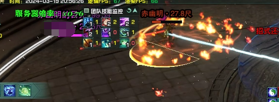​
>
> 倒计时结束后释放烈焰震爆AOE，吃龙葵
>
> ​​
>
> ### 黑影凝视——游荡黑影
>
> 点名类似安小逢追击，卡距离，过近或者过远直接重伤，50秒狂暴
>
> ​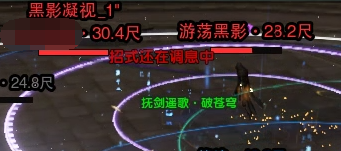​
>
> ‍
>
> **老一**
>
> AOE附带20s持续掉血，龙葵保不住盾
>
> 点出纯应对持续掉血奇穴都是一坨（点妒因双当岚微更是一坨）
>
> 不染莲池和晴柔10%双倍温增疗修饰的莲花，自回攻回占比超不过15%，占比基本在12-14%来回跳动
>
> 莲花CD还跟不上斩海3轮一次循环的前2个斩海间隔，最多只能斩海1吃一半斩海2吃全程
>
> 素柯本身的延迟1.5秒后5人素柯单跳治疗，一改加了30%治疗量，但是紫武当归CD16s才能触发一次，这本总有效顶了天2-4%，这30%到底加了到底干啥
>
> ​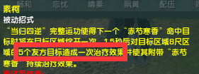​
>
> **老二**
>
> 龙葵想保，只能保每轮循环的第一个香风远程盾，提前给，防破盾
>
> 药奶算比较舒适的boss，哪怕自由搏击较分散，靠中和自动选择和归潮AOE有不错的hps
>
> **老三**
>
> 龙葵可以给宝石3消踩黄圈，避免有人踩重叠圈
>
> 本来是一个体验不错的boss
>
> 坏就坏在排宝石的内伤，是全程持续掉血（参考九老洞老三到战斗结束才结束，但不是全团掉，掉血量也稍微少一些）
>
> 星驰和璀璨AOE，药奶看起来还行，HPS一下拔上来，然后内伤玩家多了，战斗时间拉越长，HPS就裂开了
>
> 如果内伤多，绝大部分情况下HPS都很惨，星驰和不吸收宝石璀璨怎么都救不了
>
> **老四**
>
> 龙葵给鹰击长空，也是个AOE附带10s持续掉血boss
>
> 咕酱，我什么都保护不了
>
> ​​
>
> 但其实体验没老三那么差，机制问题抱团较紧，站位算比较舒适
>
> 但！是！HPS没那么差前提也是键盘搓冒火了
>
> 但凡野团毒刀/承伤位置出点问题，持续掉血人数过多、缺口比较大
>
> 直接变成快乐的高付出低回报职业，真是让人玩着心潮澎湃
>
> **老五**
>
> 龙葵给旋转火刀结尾余焰震爆AOE，但如果有人吃火球，持续掉血25秒保不了一点盾
>
> HPS看上去好像行，又好像不行，又好像行的BOSS
>
> 仅从PT恶灵缠身已知轴看，药奶的凌然免控逃课体验挺不错的
>
> 治疗方面非要说，看你们团旋转火刀的小火球，团里吃的人多不多
>
> 持续掉血25秒火球吃的多，HPS就被hot奶甩开，只能≥排轴免控毒/舍身解控毒＞没排恶灵缠身自断一臂捏献祭毒

‍

# 四、提高手法（虚条）

        目前总条HPS受到的关注仍然是不够的，可能很多人连如何在茗伊战斗统计中看到这一数据也不太清楚。事实上，如果想要看到HPS总条，方法也很简单，我们只需要在战斗统计右上角齿轮里点开取消勾选“显示战斗有效数值”，就能看到总条HPS：

​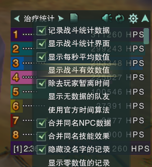​

## HPS总条的意义与作用

        我们使用的战斗统计，无论是系统自带的战斗统计插件还是茗伊战斗统计插件，默认显示的HPS数值均为HPS实条。在实战中，治疗玩家一般也都是以实条HPS为导向的，除开特殊功能性任务，奶妈大加技能也总是以实条HPS最大化为基本策略。

然而，爆发治疗量很容易溢出，而在团队掉血较少的时间段（下文简称为垃圾时间）里，大多数治疗玩家也会维持基本的治疗循环，来保证对突发情况的应急。这就在产生实条HPS的同时，也产生了更多的总条HPS。因此，总条HPS和实条HPS之间存在一定的关联性，总条HPS也包含了一定的实战信息，并且有些信息可能是实条HPS无法体现的，值得分析。

        实际上，如果关于治疗的一切讨论只基于实条HPS，即有效值的话，很多问题其实是没法讨论的，例如某个奇穴的选择，某个属性的收益，某套配装的好坏，某套流派的优劣，职业与职业之间的比较，玩家与玩家之间的手法比较等等。

         因为，决定你实条HPS的不仅是你自己，还有你的治疗队友——你的队友越菜，你的实条就会相对越高，你的队友越强，你的实条也会相应降低，并且这个“队友因素”其影响力甚至远超其他因素。所以，如果只用实条hps作为论据，来证明某者更优、更强，是比较困难的，首先必须控制队友是同一批人，甚至还需要精确到控制他们上的号也是同一批号，即控制装备因素保持不变。然而，总条HPS受到该因素的干扰就比较小，这就展示出了总条HPS的第一个作用：

## **实条HPS在不同团、不同CD之间的可比性差，而总条HPS在不同团之间可比性更好。**

         某位原本喜欢混野的小伙伴跟我描述了一个现象，她以前在野团经常每个BOSS的实条HPS都奶第一，甚至可以断层第一，而到了现在的固定团以后，实条hps想要第一就非常勉强了。这个时候，我让她关注一下总HPS，她就发现，其实无论在野团还是在固定团，同一个BOSS的总HPS她其实都是差不多的，但是野团治疗队友的总条就远低于固定团队友了。

         很显然，这是因为她固定团的奶妈队友手法犀利得多，这个犀利其实既体现在实条上，也体现在总条上。在不同团队里，你的实条hps可能会因为队友犀利与否发生变化，而如果你的手法和装备保持不变的话，你在同一个BOSS的总条HPS是可以保持基本不变的，这一点就比较接近DPS了，成为了一个较为独立的指标，受到来自队友的干扰小。

        既然总条HPS在不同团里的可比性更好，相比实条HPS来说，它受队友的影响更小，我们就可以看到总条HPS第二个作用：

## **总条可以作为实条HPS的辅助和补充，两者结合更全面评价一个玩家的实战表现**

         在奶妈相关的所谓出警贴和挂人贴中，经常会看到这样一种观点，“某某玩家HPS统计里虚条都没满，不是菜就是在划水”。这也体现了要用HPS总条/虚条来衡量一个人手法的思想。但也有不对的地方，因为在这一类帖子里，根据游戏截图，读者只能看到实条的具体数值，以及总条的相对长短，看不到总条的数值。 实际上，不同玩家的总条是很难一模一样完全相等的，如果队友虚条都是满的，其实只能说明他们刷血能力相近，并不能说明高低。

        如果第一名的奶妈装备毕业且手法犀利，实条、总条全部断层第二名的奶妈完全是正常的，此时根据“虚条都没满”去判定后面的奶是划水或者是菜也是缺乏证据的，毕竟在现阶段，手法、装备有差距的不同玩家在同一个团里清CD是非常正常的现象，DPS也是如此。

因此，我们需要根据HPS总条的具体值来进行判断，而不是只是根据总条相对长短定性地判断。

        以当前版本为例，总条HPS和职业、装备、手法、具体BOSS治疗环境都有关系。其中，治疗环境理想，主要就是指奶妈能刷血刷得很爽，具体如下：

        ①玩家能长时间站桩读条;

        ②团队站位相对集中、规律;

        ③BOSS对团队无减疗;

        ④BOSS的AOE频繁。

        我在这里列出一个粗略的大致表格，数据来源于本人实战观察，以及B站各个大手子视频里的推算，仅供参考，如果有不同意见欢迎进行补充说明：

|总条HPS|说明（25人本环境下，无共战BUFF等增益）|
| ----------| ----------------------------------------------|
|100W以上|毕业血歌，环境理想，手法优秀|
|50-70W|毕业药毒花秀，环境理想，手法优秀|
|40-50W|BOSS环境稍差/装备不错但尚未毕业/手法良好|
|30-40W|BOSS环境较差/装备普通/手法合格但仍有提升空间|
|20-30W|BOSS环境很差/号较小/手法需要提升空间较大|
|10-20W|萌新、划子、直升小号|
|10W以下|请问你是打本打睡着了吗？|

        以上表格不包含盾歌和大彼流奶花，因为精力有限，没有留心过这两者的总条HPS

        从上图表格我们也可以看出，治疗玩家的上下限差距极其之大，下限甚至可以低到只有上限的10%-20%。这一点，与dps有一键宏作为保底是大相径庭的。

        将目前版本具体每个BOSS放入表格中大概是这样的，将手法与装备因素合并起来作为个人刷血能力的分级，分为S-E几个等级。由于血歌的特殊性，将其S级额外标出：

**九老洞版本奶妈总条HPS分级表（不含盾歌和大彼）**

||魏华|钟不归|岑伤|鬼筹|麒麟|月泉淮|
| ----------| -------------------------------------------------------------------------------------------------------------------------------------------------------------------------------------| --------| ------| ------| -------| --------|
|100W以上|血歌 S|/|/|/|/|/|
|50-70W|S|/|/|/|血歌S|/|
|40-50W|A|S|S|S|SS|S|
|30-40W|B|A|A|A|S|A|
|20-30W|C|B|B|B|A|B|
|10-20W|D|C|C|C|B|C|
|10W以下|E|E|E|E|E|E|
|备注|老四是不处理机制只看大团的奶（在抢甲开荒阶段这个位置是不存在的），如果上点承伤、搬石头的话，需下调1-2档； 老六主要是削弱之后下P乱杀全团抱团刷血的数据，但削弱前的数据其实也差的不多||||||

         我们可以看出，大多数BOSS的总条情况其实是相似的，而英雄麒麟这个BOSS需要特别提出来说是因为这个BOSS确实治疗环境比较不理想，无论是夏天分散跑扇形，分散处理火焰旋涡，冬天的沉默和跳环，秋天的排风灵珠和乱七八糟的队友站位，春天的减疗等，都对总条HPS产生了不利影响，所以这个BOSS也特别能看出奶妈刷血能力的高低，特别给了一个SS的档位。

         奶妈毕业速度往往会比DPS快，并且副本越削弱，奶起来也越没意思，很多大手子奶妈在赛季初就早早毕业了，AFK去玩隔壁别的游戏了。所以很多一直打削弱以后简单本玩家，碰不到这些大手子，自己手法有限，对自己奶装的提升也要求不高，可能一个版本结束了也看不到我表格中前面几行的那些数据，但这些数据都是确实存在的。

## **③治疗溢出环境，总条HPS更能反映出治疗职业的上限**

         在上述表格中我列出了高达50W-100W的HPS总条，而这只是一个奶，假如按4奶（药毒花秀）+血歌的高标准去计算，全团HPS可以达到300W以上的hps，然而实际副本中的BOSS能让团队HPS上30W的BOSS都寥寥无几，能让团队HPS上100W的更是天方夜谭。一个BOSS治疗溢出率高达80%-90%，甚至更高，都是家常便饭的事情。

         诚然，这个问题也涉及到掉血模型的问题，例如间歇性掉血的BOSS最终团队总HPS往往是低于持续掉血的BOSS的，但间歇性掉血的BOSS治疗压力却有可能会更大。然而，现实是，当前版本即便是间歇性大掉血的BOSS，其治疗最高压期的HPS考察也依然没有达到   5奶的设计标准。在治疗溢出如此严重的环境下，实条HPS就很难反映出真正的治疗上限了，此时玩家更多讨论的是如何抢hps，交技能的逻辑也成了越快越好，巴不得所有技能都变成落子无悔或者七情龙葵这种瞬发技能方便抢HPS。但我在这里也只能再次强调，畸形的溢出环境是这个问题的罪魁祸首，同时也想提醒策划在副本设计的环节需要更全面地考虑治疗职业的上限与玩家体验问题。

## **④目前游戏中的HPS实虚条统计仍然是当前游戏内最好获得，且总条HPS是较为综合、客观的参考指标。**

        目前在实条HPS以外，很多人提出了其他评价治疗表现的指标，比如技能数以及一些人为定义出来的新的HPS概念，这些指标都有各自的优缺点。

         关键技能的技能数可以衡量玩家技能衔接是否足够紧凑，手法是否合格，比如奶秀的回雪系数，奶花的握针数，奶药的中和数等。但是技能数基本上抛弃了装备的因素，无法看出优秀装备对手法的弥补作用或者锦上添花作用，尤其是妙手五彩石这一重要因素。其次技能数受加速阈值影响，一般衡量技能数也只在满加速的条件下进行，很多装备尚未完全成型或者配装思路不同的玩家，就无法进入讨论的范围内。

         还有一些人为定义的新HPS指标，也有一定道理，但最大的问题还是需要借助脱离游戏的外部分析工具，可推广性差，即便在赛季最初的抢甲开荒时期，最看重治疗水平的阶段，会开工具分析治疗数据的人也是不多的，而在这个时期过去以后，更加不会有人使用这些分析工具来分析治疗数据，这些新HPS指标也就成了无人知晓的东西。此外，这些指标往往会有人为强行定义的一个权重或者区间，科学性上也仍然有值得商榷的空间，例如，为什么定义权重或者区间为x，而不是x-1或者x+1？或者x-0.01还是x+0.01？有统计学分析在背后支撑吗？

        总条HPS在游戏内非常容易获得，只需在茗伊战斗统计中取消勾选显示有效数值就能看到，它是职业+装备+手法+BOSS机制等因素综合作用下的结果，包含的信息量较大。

## HPS总条的局限性

         而回归到现实中，由于剑三PVE奶妈不缺蓝的特点已经延续了非常久的历史，目前大多数玩家都已经接受了奶妈即便在团队不掉血时期，依旧维持基本治疗循环的默认游戏规则，这主要也是为了在团队出现掉血目标的第一时间，奶妈能有瞬发大加资源或者hot对其进行治疗。在大加CD循环的过来的前提下，会用一些爆发技能抢禅语或者突发意外掉血。

        所以，上文中提到的总条HPS数值的表格，实际上是基于一个大前提的：

                **奶妈在垃圾时间中依然采取维持基本治疗循环的策略，既不停手，也不过分交全套爆发去“恶意刷虚条”。**

         假如玩家喜欢垃圾时间划水停手不奶，那么他的总条HPS显然就会比表格中同条件数据更低，而假如玩家喜欢在垃圾时间依然交全套爆发，那么他的总条HPS显然就比表格中同条件的数据更高了，但是他这样做也是冒着下次掉血技能CD转不过来，实条亏损的风险，需要对BOSS时间轴有更清晰的认识。

        实际上，  HPS总条和HPS实条会出现矛盾的情况，即总条更高的人实条HPS可能更低，主要原因如下：①团队掉血关键期的治疗量贡献不足，用垃圾时间的总条HPS撑起来了全程的总条HPS；②团队掉血模型和职业治疗模型不匹配；③治疗溢出太过于严重等。此时我们需要同时结合实条和总条一起判断，认清楚背后的原因，防止得出错误结论、胡乱出警。

         讨论到这里，可能会有不少读者想要提出，既然PVE治疗如此溢出，垃圾时间这么多，不如建议策划给奶妈做输出技能，让奶妈不需要刷血的时候打打输出，岂不美哉。对于这个问题，我的态度仍然是反对的，原因有很多不具体展开，最主要的问题就是平衡，既涉及到奶妈和正经DPS之间的平衡，还涉及到奶妈内部的平衡。在开了一个手游端的天坑以后，我不认为剑三技能策划还能再腾出精力来做一套全新的奶妈PVE的输出系统，同时还能把这个系统调到平衡，毕竟PVE的DPS都从来没有平衡过。

‍

# 五、好用分享

**[1、药奶百战和摆烂一键宏](https://www.jx3box.com/macro/56931)**

**2、dbm监控其他奶妈技能，效果如下图（合并原文件优先）**​**[武狱黑牢奶妈技能监控.encrypted.jx3dat](https://cdn.jx3box.com/upload/post/2023/8/9/126820_5195358.jx3dat)**

**[九老洞奶妈技能监控.encrypted.jx3dat](https://cdn.jx3box.com/upload/post/2024/3/4/126820_986575.jx3dat)**

​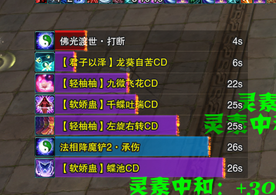​

**使用方法如下：**

​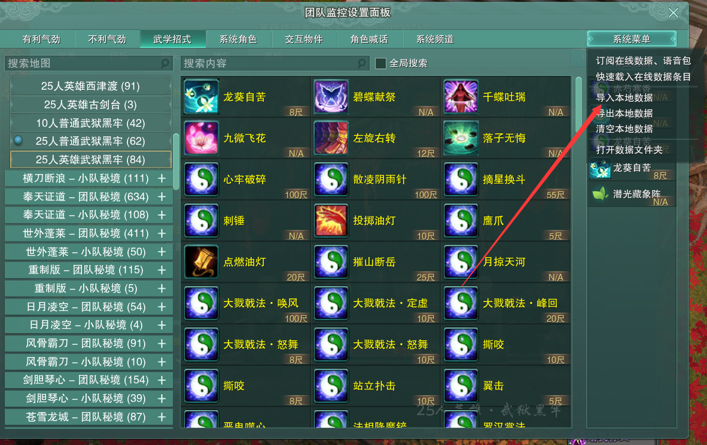​

​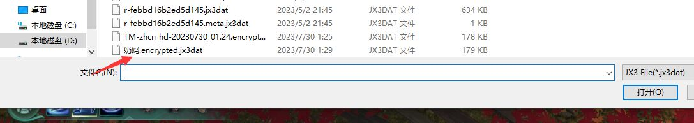​

​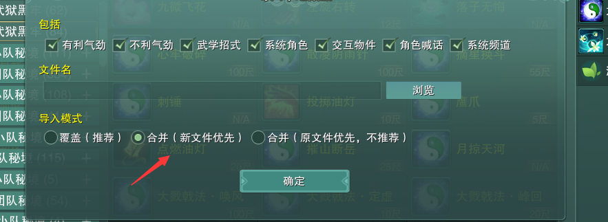​

**3、监控千枝+秋江（包含常规自身增益和对boss增益）**​**[药奶监控（秋江版可自改飞剑）.jx3dat](https://cdn.jx3box.com/upload/post/2023/8/9/126820_385865.jx3dat)**

**在目标监控处导入即可**

‍

# 六、辅助宏和按键工具（仅作为技术推荐）

## 简述自动选择目标

我们可以用快速选择目标来方便自己选择血量最低的队友，需要注意的是把锁定范围缩小到20尺内，以防选到20尺外读条不到的队友，以我自己为例，将快捷键设置为0，设置方法如下：

​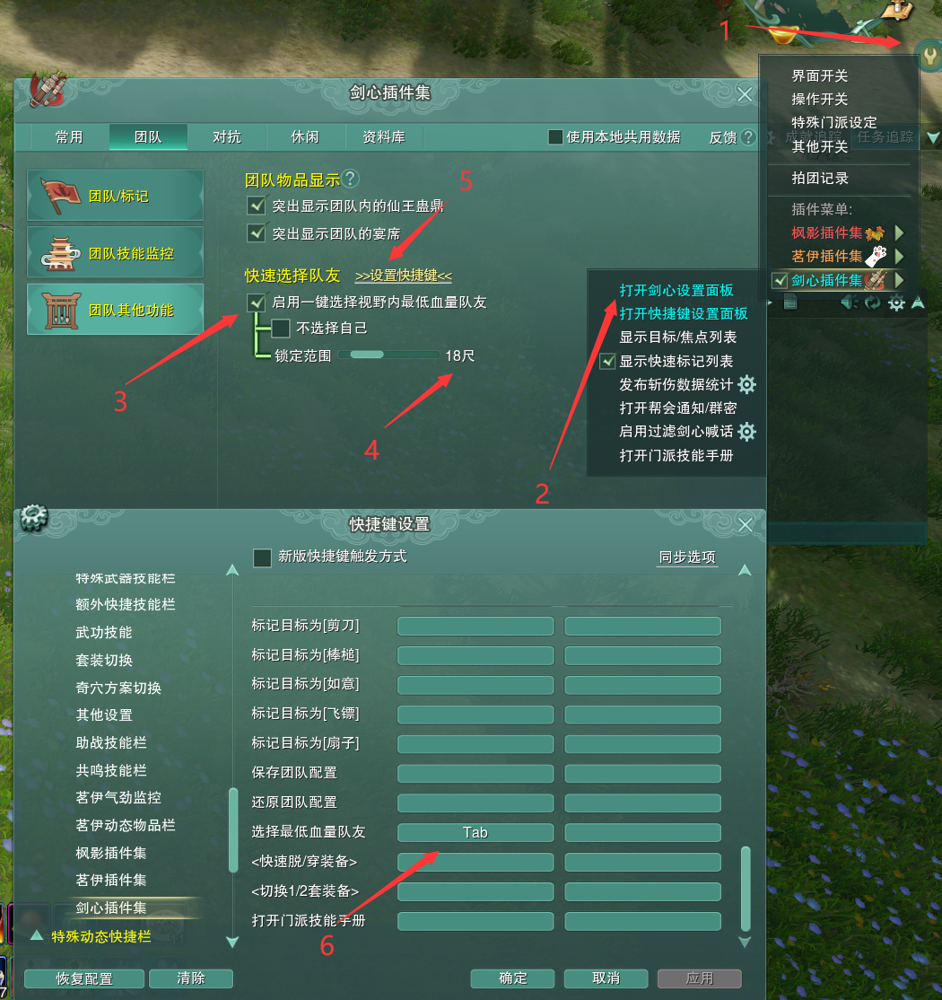​

​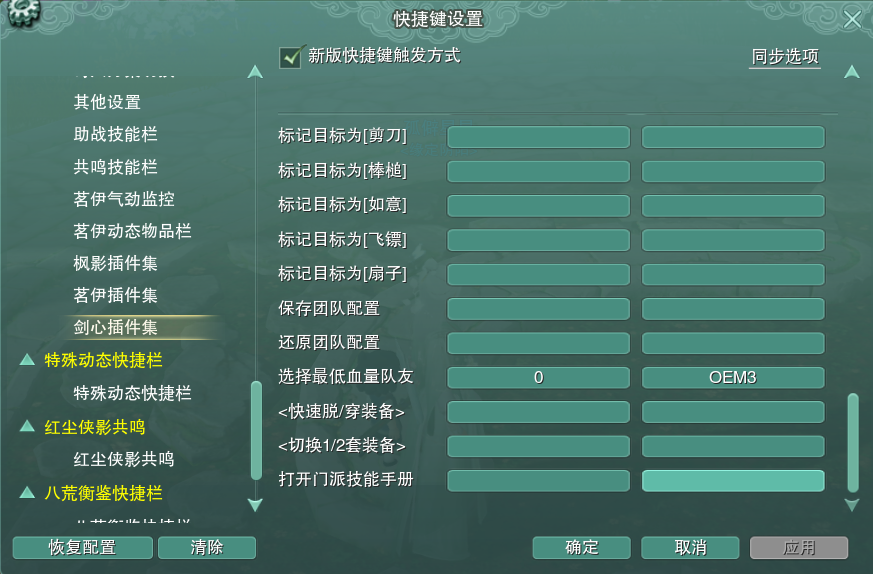​

然后如dps打开一键宏按键，设置为宏键位，延时建议为500ms，启动后，将自动选择20尺内血量最低目标，**亲测可以提高20%左右有效治疗量**。

**但要记住这不是自己手法有提升，手法菜还是菜**

​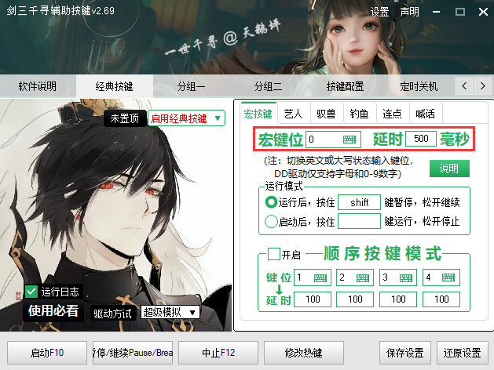​

## **鼠标宏**

[ 火焱焱 ](https://www.jx3box.com/author/109918)​**3天学会奶药辅助鼠标宏（增加新版温流常规宏）**

## 自动开关花赤芍

设置原理为硬件宏模拟按键触发，自己学习鼠标宏设置

## 灵素PVE循环宏

请自行查阅魔盒，不推荐

‍
