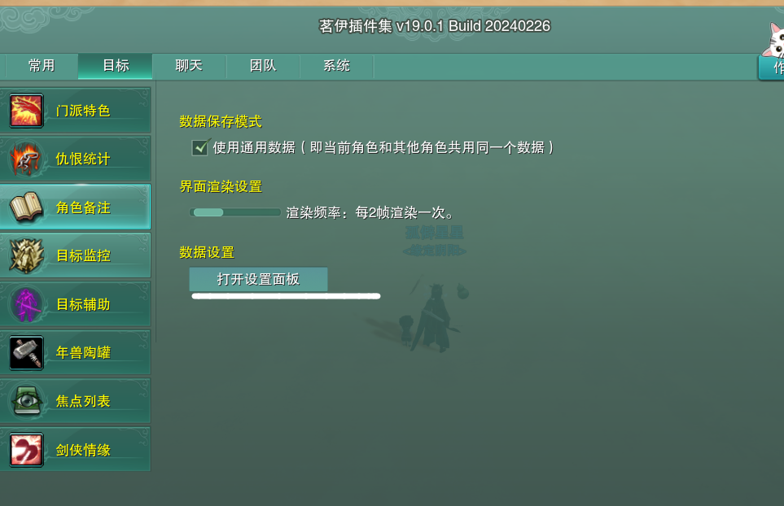
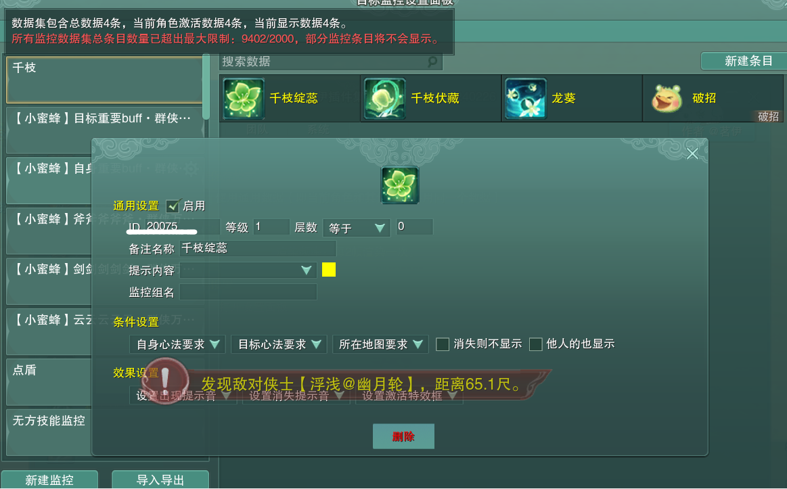

# 药宗气劲监控图文教学

# 1.气劲卸除

气劲卸除是灵素必须学会的，温流的白白开赤关中，都用气劲卸除来关千枝，以达到不用等技能CD即可秒关千枝。设置方法如下：

## （1）打开茗伊插件集

按esc 打开插件管理

或右侧小地图下有一个小扳手样图标

## （2）设置监控

找到目标 目标监控 创建 

​​

‍

## （2）气劲监控

首先设置气劲监控“千枝绽蕊”，数据id“20075”，气劲等级“0”​​

​​

亦可联系孤僻星导入 千枝.jx3dat

## （4）气劲卸除

然后ESC→快键键设置→下翻→ 茗伊气劲监控→ 卸除气劲1-1里。设置的是数字键1右边的“~”（OME3）键，也可以设置为鼠标滚轮，就可以白芷→白芷→千枝→赤芍→关千枝

​​

​​​​

# 2、目标选择

我们可以用快速选择目标来方便自己选择血量最低的队友，需要注意的是把锁定范围缩小到20尺内，以防选到20尺外读条不到的队友，我的选择快键键是Tab，设置方法如下：

​​

# 3、额外蓝条

作为蓝量十分重要的奶妈，我们也需要监控自己的蓝条，但是如果角色栏的蓝条太远看着不方便怎么办，可以像我一样拖到屏幕中间放在和药性栏一起的位置。设置方法如下：

​​

‍
