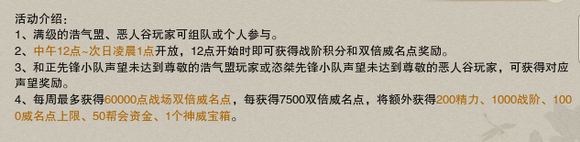
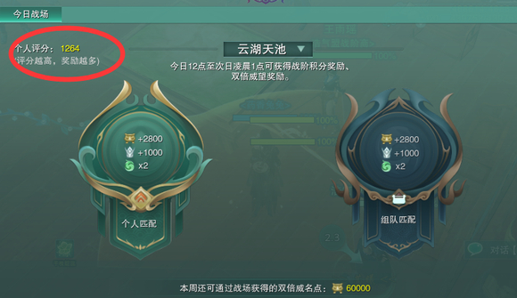
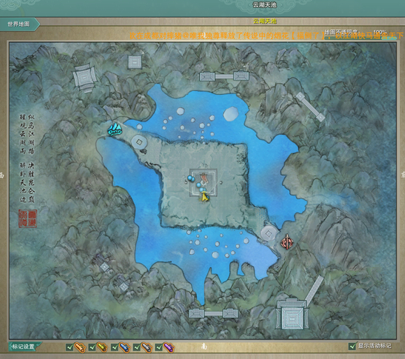
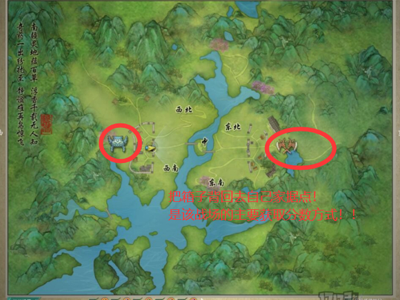
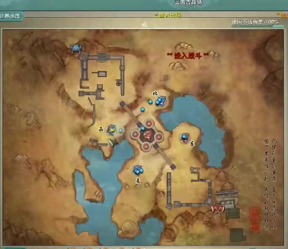
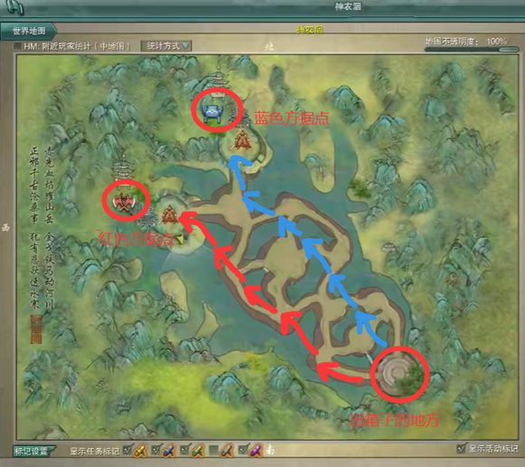
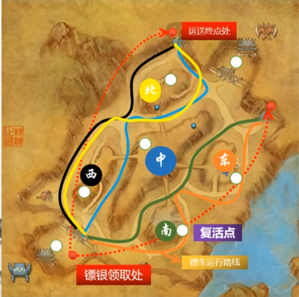

# H11 战场

孤僻星

---

# 药奶分析：

首先提醒新手朋友们：  
1.把白芷秘籍“凌然天风期间顺发”点上，凌然天风抗摔秘籍点上。

2.不要点同梦不要点同梦，即不点群盾。

点同梦后的盾一分钟一个，非常影响队友或者自己尝试开旗。群掉血的情况并不用盾来抬血，打群架很难精准预判每波大伤害提前给盾，同时给群盾导致其他奶妈大群加全还花呗了，不如单盾实在。  
同梦更适用于pve。

3.每个不记得开千枝的笨蛋都会被我踹屁股。先不论减伤，有千枝和没千枝的hps是天上地下的。

5.寒性放莲花是莲花受到的伤害降低，温性放莲花是莲花的治疗量增加，所以喜欢满温起手。

6.上天期间所有技能距离+5，那么此时银光照雪的施展距离是11尺，此时打平摊不容易吃aoe伤害。

7.大加青浦着尘陆地上放只有12尺距离，上天放才有17尺。

8.七情本身的治疗量只有药奶本人吃，队友吃的是中和。如果没点忘忧没任何药性，选中队友按七情会无事发生。

9.点了浅碧，没点渡若的话，可以一段飞过去秒接当归，以避免一段被控。凌波飞叶令和其他技能不共用一个公cd，所以可以瞬发白芷的同时给个银光。

‍

# 战场介绍

战场是多人团战的pvp玩法，有10v10，15v15，25v25三个人数的战场。在日历图标可以查看每天的战场。每个战场地图的玩法不一样，获取积分的方式不同、取胜的方式也不同，无论输赢，都可以获得威名点和战阶积分，用来换取PVP装备，如图所示每周最多获得60000点双倍威名点。在此做简单介绍。10v10战场有云湖天池，15v15战场有浮香丘、神农洇、三国古战场，25v25战场有西风古道（丝绸之路）、九宫棋谷（珍珑棋谷）。虽然是团战，但和个人手法仍然密不可分，要多多练习手法哦。以下会简单描述战场及其玩法，萌新必看！详细的进阶攻略会慢慢放出。  
推荐战场职业（通用）：  
DPS：苍云、田螺、衍天、霸刀、天策、藏剑  
奶妈：奶药、奶毒、奶秀  
​​

战场也是有个人评分的，评分越高奖励越高，遇到的对手也越强劲。严格限制配置的组排队伍里，个人分数一般在2000以上，在主城战场区找浩气盟/恶人谷战场接引人排队进入战场。  
​​

战场里和JJC里一样都是用战场频道交流的，也可以打开听筒，听野生大佬指挥哦！  

## 云湖天池：

简称云湖。云湖天池是10V10战场，获取积分的方式有两种，第一种为击杀敌对阵营侠士，1个人头1分，第二种是读条开旗子，1个旗子开旗需要15秒时间，读条时受到伤害有概率被打断，受到控制必定被打断，被打断需要重新开旗。开局2分钟刷新第一个旗子，旗子被开启后每3分钟刷新一个，先获得100分的阵营获得胜利。  
​​

推荐职业：  
DPS：苍云、藏剑、天策、苍云、气纯、田螺、剑纯  
奶妈：奶毒、奶药、奶歌  
特定配置下，很多职业都可以愉快地打战场！

## 浮香丘

也称箱子丘。浮香丘是15V15战场，获取积分的方式有两种，一种是占领据点，人数多的一方站在旗子附近一定时间，则占领据点。据点被任意一方占领后（点上旗子为红色或蓝色），每5秒钟获得1分，据点被占领每1分钟会在据点内刷新出浩气盟/恶人谷菌箱，读条2s即可拾取菌箱，读条判定和云湖天池的开旗一致。第二种获取分数方式就是背箱子，拾取自己家菌箱背回去自己家据点，团队可获得10分；拾取敌对方菌箱背回去自己家据点，团队可获得18分。注意！！！人头在这个地图是不计分的,不要沉迷打打杀杀！！！

先获得600分的阵营获得胜利。  
​​

推荐职业：  
DPS：苍云、藏剑、天策、冰心、刀宗  
奶妈：奶秀、奶花、奶毒、奶药

## 三国古战场

简称三国。三国古战场是15V15战场，也是和JJC模式最相似的战场，比拼小队实力。获取积分的方式只有一种——占领据点。圆盘内的阵营人数多，则会增加据点士气，士气条满了，成功占领据点，1个据点每5秒涨1分。每个据点上的战斗可以看做33/55竞技，比较考验手法。一共有5个据点，一般拥有3个据点的阵营容易获得胜利；这个地图的人头也是不计分的，所以，不要在一个点里打架上头哦！！！！！！先获得500分的阵营获得胜利。  
​​

推荐职业：  
DPS：田螺、衍天、无方、剑纯  
奶妈：都可以

## 神农洇

简称神农。神农洇是15V15战场，获取积分的方式只有一种，就是把物资箱背到自家据点里，路程约如图所示。开场30s会在台子上刷新物资箱，读条时间为10S，读条判定和云湖天池一样。背负物资箱的玩家被杀后箱子将会掉落，重新拾取箱子读条时间比初始时间短（具体时间我忘了！）。保护好己方箱子手到达终点，尽量缠住更多的敌人！要注意，在水里会受到持续伤害，人头在这个地图也是不计分的，不要沉迷打打杀杀！！箱子被第一次背起来后的5分钟出下一个箱子，在送达箱子后的30s也会出下一个箱子，箱子有覆盖机制，感兴趣的小伙伴可以自行查询。送达1一个箱子得1分，先获得3分的阵营获得胜利。  
​​

（截图源自网络）  
DPS：刀宗，苍云，藏剑，气纯  
奶妈：奶秀，奶歌，奶药

## 西风古道

又称坑爹之路，西风古道主要有3个得分点：开旗、镖车、镖银。万变不离其宗的2个原则：开旗与防守。率先达到1000分的一方获得胜利，杀人不得分： 1个镖银5分，因门派轻功差异各职业所需时间不同，藏剑大约1min一个来回：占领1点1分/5s,同时占领5点10分/5s白旗5s,敌旗10s: 500分时，根据占点数刷新物资车，每车抵达终点后（约3min)可获得100分；成功击毁敌对镖车1辆可加50分；示意图用不同颜色标记了出车路线与点位的关系调点应当以开旗和防守为主，观察队友重伤的位置，以复活点就近原则为基础进行支援。

​​

（截图源自网络）

DPS：刀宗，苍云，天策，藏剑，万灵  
奶妈：奶秀，奶药
