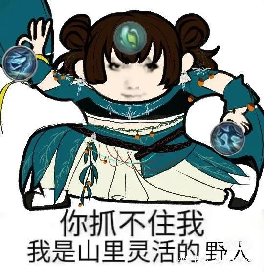
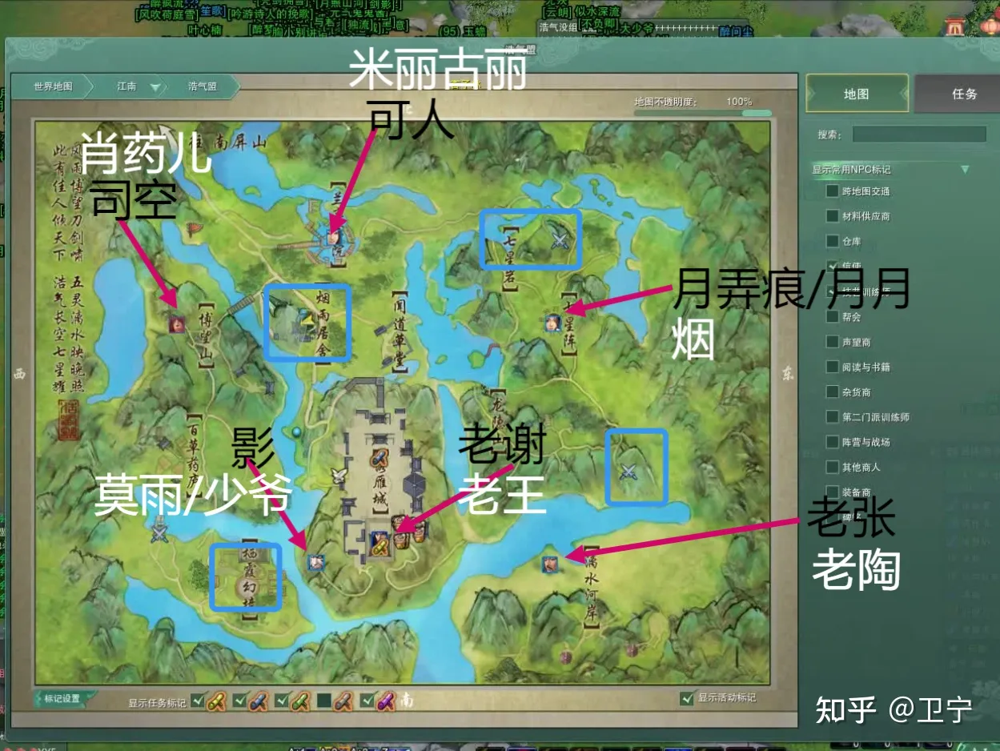
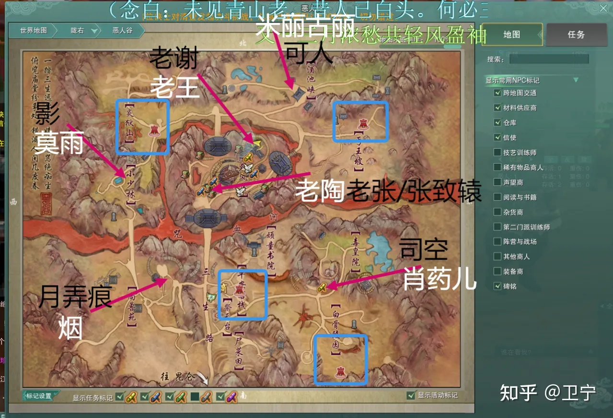
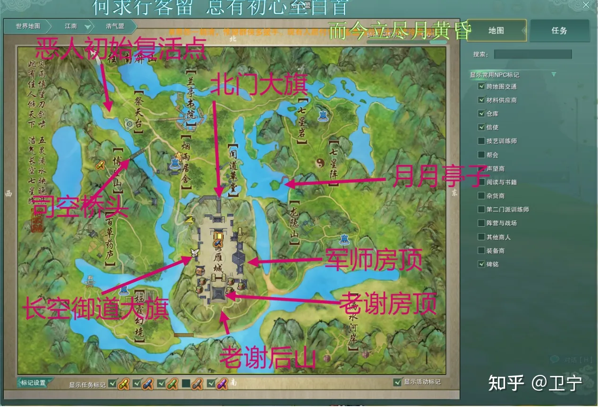
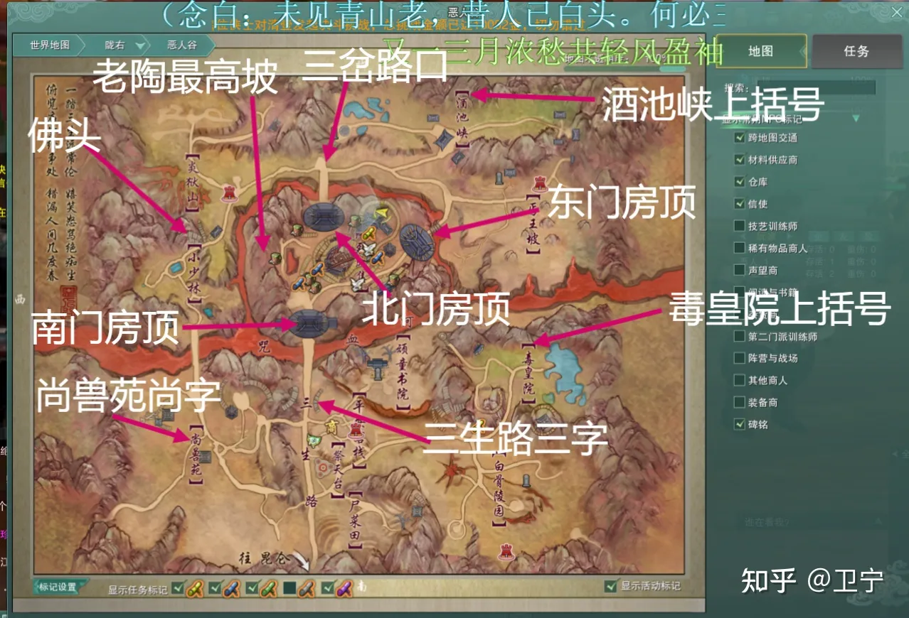

# H12 攻防野外

孤僻星

攻防和野外都属于大型团战现场，与其他情况不同，攻防野外下通常没有固定治疗目标，血线掉的速度快，作为一线医疗兵，请优先选择活下来和治疗量两个任务。

因此攻防野外这种情形下，推荐请使用PVP攻略中多人战场奇穴，以增强保命能力。

‍

---

‍

# （1）野外

‍

​​

# （2）攻防

字多不看版：

1. Ctrl+M  打开沙盘，看下那个位置是交界处
2. 到点了神行或者过图去那个地方（小攻防在交接处，大攻防，周六在浩气盟，周日在恶人谷）
3. 进入之后加入一个队伍
4. 跟着队伍参加战斗就好了，右侧会有一个提示框  个人贡献分达到要求了就有攻防奖励了

以下文章转载自https://www.zhihu.com/question/473419952 [卫宁](https://www.zhihu.com/people/wei-zhu-88-21) 关于攻防的回答。

首先攻防这玩意儿分为大攻防小攻防，排队机制不太一样。

### 小攻防

小攻防目的是为了敲掉对立阵营的据点，正经的活动时间周二及周四晚是20：00-22：00，但是准备时间会更早，而且每次的排队地图可能都不一样，具体排哪张打之前阵营频道问一问就行，一般是周二周四晚19：28（好像是这个时间，我也好久没玩了）准时排队，小攻防

一张地图能进200个人，但是里面有两个据点帮，每个据点帮能提前进图25个总计占掉50个名额，所以其实真正靠手速排队能进图的只有150个人（不包括有免排队牌子的人。）

进图之后首先个人建议是上攻防yy，具体yy号是多少你可以看地图频道，你放心不会没人刷的，yy没人指挥比你更急。另外就是要注意在19：50/19：55有两波答题，题目都很简单，答案基本一眼就能知道，答对的继续留在图里准备攻防，答错了就寇岛当岛主，你放心，寇岛岛主位置也挺好的，很抢手的。

小攻防开场正经指挥都会安排先炸塔炸工坊，炸箭塔  
，具体在哪你可以跟着大部队飞，这样吃分吃的比较多。队伍问题你就直接地图扣个字问问“浩有组？”/“恶有组？”，或者你看地图频道有阵营帮会组散人团不出意外你都能组到队。（这里多嘴一句，他们开散人团有时候会收人劝你进帮什么的，看自己情况，不过我的个人建议是，别进阵营帮，快跑，当然如果你热爱吃瓜并且时间充足，愿意为了阵营燃烧自己那你可以去看看，阵营帮的乐子蛮多的。）然后一般是复活点集合

，集合的时候记得买雷，炸塔用，炸完塔死了别点回营地等指挥说可以回再回，不然吃不着分怪亏的。

小攻防炸塔炸工坊炸完之后只要不是混分图  
啥的，指挥都会对大旗敲一波，敲大旗就主要看指挥说是打大旗还是打人，至于敲不掉大旗有没有所谓，那要具体看这张图的重要度（比如如果今天我进了巴陵地图，如果我们敲掉了逐鹿坪

大旗，浩气就丢了跑商高速，你说重不重要？），大旗被打掉了之后可以互动键被捡起来，不过不是专业大旗或者那种巨脆的职业建议不要去捡，容易挨骂。

小攻防的官方结束时间是22：00，但是一般来说21：47已经结束了，因为这个时候据点大旗手一般都会把大旗拉脱，大旗拉脱之后会回到原始点

，在那里停三分钟，重置完之后就能再次被捡起来。大旗被捡起来了之后需要占有十分钟才能让大旗改变归属从而敲掉这个据点。所以一般没啥希望的图或者刷分图，大家可以提早13分钟下班，这十三分钟其实大家可以组个团去敲粮仓抢钱，建议抢跑商点，巨肥！然后如果是那种打的很激烈的图，就种最后五分钟攻防结束，我的大旗占有时间还差三分钟，那这种图的对冲就会比较刺激，题主以后有机会可以自己去体验。

然后攻防结束时间有个专门的框框能看，一般出现在屏幕的右侧，框框里有“据点争夺战

倒计时”什么的，还能显示你的得分，开场的时候得分显示应该是0/50，攒够50分就是所谓的混分所需要搞到的分，一般是随便找张图混或者开场进图吃了分之后下线，或者人数实在很多的服务器官方会开放黑戈壁，完成相应任务就能混满50分，而混分一般是为了吃攻防结算的战阶奖励和白嫖拍卖资格。

攻防结束之后是有拍卖的，拍卖的东西有玄晶、坐骑、当前版本最高品阶装备、家具，这些东西的共同点是，都·很·贵

如果你要拍，建议开始的时候看一眼，然后备足金最后一分种或者几秒去加价就行了，信我，偷家的破事我被恶心过好几回。

### 大攻防

首先大攻防一周一共要打四次，周六周日每天两场，中午场12：00排队，13：00开打，15：00结束，晚上场18：00排队，19：00开打，21：00结束，周六两场在浩气盟，周日两场在恶人谷，大攻防的机制和小攻防不太一样，小攻防的目的是为了敲据点恶心对立阵营打出好看的沙盘，大攻防的目的是为了推boss，一切以赢或者推老谢

老王为目的。下边细说。

首先还是排队，大攻防的排队时间是周六周日中午的十二点整，在各大主城或者去黑戈壁找冷x之的npc排队，不是很建议卡过图点，容易被对立阵营干掉，但是据说有办法死了也能过图，但是我没学会，你感兴趣可以去问问其他人。十二点准时排队，十二点零一分  
开奖放人进图，优先放装分大的/战阶高的这类人，一张地图一个阵营可以进400人，同时存在好像是20个免排队牌子吧好像，数字记得不是很清楚了，所以恶人谷浩气盟两张地图的巅峰人数应该是可以同时在图820人左右，排队好像是分两波放人进图，如果两拨人都放进去了，你的排队数还在3/4/500+，那么这个时候我们一般会建议你去做个攻防前置。

攻防前置周六在南屏山，周日在昆仑，如果在人口大服比如双梦唯满侠什么的，建议提早进图，不然进不了浩气盟恶人谷就算了，连南屏山昆仑都进不去，夺笋呐。而且推荐去做攻防前置的另外一个原因就是，你可以做完前置顺便等到攻防开场再摸个鱼捡个垃圾混个分。

没错大攻防混分就是在这两张地图摸鱼或者捡材料，鱼好像是一条五分要攒够200分也就是40条，摸鱼的话南屏山在那条大河边，昆仑  
在地图中间，混够了200分你就能拿到一个buff【拍卖资格】，也能吃到结算。

如果你顺顺利利的在十二点准时进图了，先别急着去干饭或者去干其他事儿，给指挥留宝贵的十五分钟，一般有想法的指挥都会在这个时候打一波快攻，具体操作就是打复活点，比如说我今天进攻浩气盟，我是恶人指挥，今天我运气好我的400个进图玩家都是听指挥上yy的，然后我带着这400号人把只有两百多号不到三百号人的烟雨居舍复活点或者周峰复活点，dps

再高一点俩复活点我都敲了，那这场攻防我就已经在一定程度上拿到了主动权。

所以，请大家给指挥个面子陪他们打个快攻吧，就十几分钟，打的下来就打，打不下来就等开场就行。

开场前老规矩还是有两波答题，中午是12:50/12:55，晚上是18:50/18:55，答对准备开场，打错寇岛当岛主。

一般来说攻防只要人数够指挥够都会分大小团，小团一般就是阵营帮会团，人数一两百，具体数字看具体服务器的帮会团人数决定，小团一般都是机动团，就那种千里飞，比如浩气盟地图周峰飞司空，恶人谷地图平安飞炎狱山

。主要是用来救场的。有可能就是我大团在打烟雨小团在干司空或者影老张之类的其他boss，然后浩气回来救烟雨，但是烟雨血线已经被压下来了，我是指挥我就是要敲掉烟雨，这个时候小团就得回来救，补人数补dps。

还有什么功能团比如t团，车团，霸刀团，藏剑团这类的东西，后两个看名字都知道是啥，前两个可以稍微说一丢丢，t团主要是那些t职业，用来拉boss仇恨的，有些t还会嗑仇恨牌子让自己拉的稳一点，据我观察这种t团的t一般都是固定的那几个人，熟能生巧吧。车团也是，攻防有大小车，这种功能团就是专门开车的，小车机动性好，点大车快的一批，大车跑得慢但是伤害拉满，恶心人这方面它是专业的，能推人能打人，就是开起来手感确实不咋地。

还有就是打掉boss之后记得摸一下boss留下的那堆垃圾，也就是俗称的“翔”(๑•ี_เ•ี๑)

因为大攻防这个东西的来历比较奇特，是专门给大家用来互推boss的，所以恶人浩气两边的boss数量都是相同的，大boss各六个，复活点boss各四个，分布在地图的几个点位上。如图（自己存的图当初删掉了，网上随便扒拉的）

这是周六浩气盟的地图，红箭头指向的地方是boss点，黑字是浩气盟初始boss，白字是浩气boss被打退场之后对应的恶人谷登场boss，蓝框框里的是复活点，地方太小不好标字，七星岩

复活点的对应boss是陶杰，陶杰退场之后上场的是吕沛杰，烟雨居舍的对应boss是谢烟客，谢烟客退场之后恶人谷的出场boss是顾延恶，栖霞幻境的对应boss是郑鸥，郑鸥退场之后登场的boss好像是陶国栋，最后图片右下方的那个点具体名字没有，指挥们一般称呼这个点都是直接叫boss名字即周峰，

周峰退场之后上场的是张一洋。

复活点重点注意一些烟雨和周峰，这俩的优先级最高

下边那张恶人谷的地图也是同理，boss点位改变了，复活点也改变了，但是对应的出场boss是不变滴

​​

周六浩气盟地图boss点及对应boss退场后敌对阵营登场boss

​​

周日恶人谷boss点位及boss退场后对立阵营出场boss  
然后攻防有时候指挥会说一些奇奇怪怪的代号，大概位置就是下边这样的，欢迎大家补充（小声bb主要是有些我也忘了），然后如果说什么例如什么七星阵阵字/三生路  
三字/酒池峡上括号，就直接看地图往那个字那飞就行，地图的字是不变滴

​​

周六浩气盟常用集合点

​​

周日恶人谷常用集合点  
然后有些指挥会说什么飞过闻道草堂  
摔死，飞过龙隐山摔死，飞过月月亭子摔死，飞过咒血河摔死，本质上就是为了让你们补快点，比较摔死回复活点有时候确实比你哼哧哼哧飞半天快很多。  
说到boss的话肯定绕不开的是指挥，周末攻防有指挥车和指挥团，指挥车能拉boss，即把boss从点A召唤到点B，但是这个功能只能在boss有效血量（当boss血量低于10%时boss退场，这10%视为无效血量）不低于80%，即boss当前血量需要≥90%才能使用，并且这个功能的使用是有cd滴，cd好像是15-30分钟不等，并且指挥车还有副驾驶，副驾能拿好多人头（馋），具体的指挥车功能题主有兴趣可以日后自己去了解一下。而指挥团的投票选举就要靠你们手里的烽火令了，每一万战阶可以去领取一个烽火令，烽火令可以给指挥团投票，投票选对了下周还能返还站街和威望牌子。

指挥还能给地图标点，这个时候你就要打开地图看看指挥标点是啥样的了，比如一号点标在哪个boss位置上，以此类推，然后要随时注意指挥有没有换点位，毕竟防火防盗防007.

‍

简单来说，萌新上yy跟着指挥打就行了，指哪飞哪跟着指挥跑！

‍
