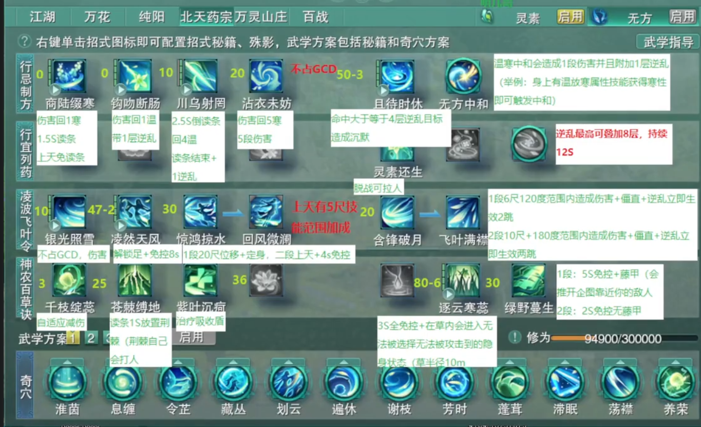

# D1 零基础

孤僻星

# 〇、 约定

“ 本文的诞生是因为我收的徒弟们真的总有很想要挑（zhe）战（mo）自己的人  
让我想到会有人真的非常想要直接打常规无方的奇穴，所以写的一个基础普及的文章。  
本文针对人群为无方纯新  
重要：如果你已经会打无方了，本文可能对你没有任何帮助！”

整合自 **[迟妄](https://www.jx3box.com/author/213107)** **大佬的**​**[【万灵当歌】《无方制物经》无方PVE新手入门图文攻略](https://www.jx3box.com/bps/59846)**

本篇针对无基础萌新药宗玩家，对剑网三完全没有游戏经历的玩家。  
每个人都是从萌新一步步走来，我希望能让更多人喜欢上这大美江湖。  
不懂就问，不会就讲，保持友善交流的氛围。  
如有错误或误导，还望各位大佬当面指出，以便及时修正。  
本篇内容可能较为啰嗦和重复，有游戏基础可以从D2开始阅读。

联系方式：

电五乾坤一掷-孤僻星星-2731155821

---

# 一、**心法介绍**

## 门派背景

《无方制物经》终可拼为全本，医药之学，其路修远。

门中先人著述甚丰，读来顿觉惭愧，我辈更当朝夕不倦，方不负前人苦心。

吾生而有涯，若能传芳百世，恩泽百代，方为不往。

具体想了解可以阅读 Z0 溯源篇

## **心法介绍**

此功以无方为名，亦代指北天药宗至高典籍《无方制物经》，旨在娴熟使用药理制物，配方运毒。称得上是驱草为刃，毒药双生，足竞百兵之锋。

​基础气血值提高23%  
             内功防御等级提高950点  
             外功防御等级提高950点  
             化劲率提高10%  
             内力最大值提高121743点  
             内功攻击力提高3808点  
             毒性内功破防等级提高1788点  
             外功防御等级提高763点  
             每点体质额外提高1.5点内力最大值  
             每点根骨额外提高1.8点内功攻击力，0.47点毒性内功破防 等级  
             施展武学招式在经脉中残留的每点不同药性将会互相抵消并 产生一次中和效果，对目标造成一次伤害并额外附带一层“ 逆乱”持续伤害效果

**即无方为根骨职业，造成毒性内功伤害，技能释放距离6-20尺，属于远程输出职业（虽然通常站近战位，同时瞥一眼隔壁凌雪小野猪）。**

## 阵法介绍

什么是阵法？同一小队可以获得阵眼的阵法增益，对于dps职业而言，阵法带来的dps增益非常重要。

​乱暮浊茵阵  
一重粗识：阅历提高5%,声望提高5%,内功基础攻击提高5%。  
二重略懂：招式伤害和治疗成效提高3%。  
三重巧熟：全会心几率提高5%。  
四重精妙：招式会心则阵眼回复1%内力值。  
五重游刃：阵眼产生“中和”效果，使得小队成员下一次伤害招式将附带一段毒性内功伤害，该伤害取决于阵眼的内功攻击、破防等级、会心几率和会心效果。（内置CD10秒）  
六重忘我：若重伤目标，则阵眼技能调息速度加快40%,持续15秒。（内置cd极长）

**阵眼选择：**

有螺情况：无脑选螺。

无螺情况：有花吃花，无方如果够强力，尽量安排毒经衍天同队开无方阵。其他情况，吃气纯或莫问阵

**一般不吃自己阵，除非实在没阵吃。**

# 二、机制解释

无方在pve中的主要伤害来源是无方特有的机制“中和”，无方心法下不同技能会提供“温”与“寒”

下文将会称温药性为正数1 2 3 4 5 寒药性为负数-1 -2 -3 -4 -5

为方便理解如下配图

​此为0药性（无药性）

​此为-5药性（5寒）

​此为5药性（5温）

而中和可以理解为在已有温药性时获得寒药性，或者在已有寒药性时获得温药性

可以结合下文技能介绍理解

机制介绍参见H1灵素部分对中和的描述。。。

# 三、技能介绍

前言：技能介绍部分会有意省略一些对于pve并不重要的内容

游戏过程中会在升级过程中初步使用各种技能，具体伤害循环机制请看详细解析。

​​

### 简述：

‍

‍

### 详述：

```
ID:27551 商陆缀寒 (商陆缀寒) 运功1.5秒，对目标造成毒性内功伤害，并使得自身获得1点寒性。低0.5秒，成功施展后使得自身基础调息时间降低0.5秒><TALENT 28443 1 施展“商陆缀寒”降低自身“紫叶沉疴”“苍棘缚地”1秒调息时间> 
```

寒性小技能，提供1点寒性

在第六重奇穴[[坚阴]](https://www.jx3box.com/app/database/?type=skill&query=28410&level=1)修饰下可在药性为0时提供3点寒性，是无方重要的寒性来源之一

在第十一重奇穴[[甘遂]](https://www.jx3box.com/app/database/?type=skill&query=28443&level=1)修饰下每次释放将减少技能[[紫叶沉疴]](https://www.jx3box.com/app/database/?type=skill&query=27667&level=0)与[[苍棘缚地]](https://www.jx3box.com/app/database/?type=skill&query=27652&level=0)1s的cd

```
ID:27554 钩吻断肠 (钩吻断肠) 对目标造成毒性内功伤害并附带一层“逆乱”效果，持续14秒，可以叠加8层，并使得自身获得1点温性。
```

温性小技能，提供1点温性

在第七重奇穴[[相使]](https://www.jx3box.com/app/database/?type=skill&query=28413&level=1)修饰下可以提供一个持续16s的增伤buff，并使[[商陆缀寒]](https://www.jx3box.com/app/database/?type=skill&query=27551&level=0)可以移动释放

是无方重要的增伤buff，但在已有增伤buff的情况下优先度降低

```
ID:27556 川乌射罔 (川乌射罔) 每0.625秒对目标造成毒性内功伤害，使得自身获得1点温性，期间自身可以滞空，持续2.5秒。完整运功后附带一层“逆乱”效果。同时造成一次破招伤害。
```

提供温性的主要技能，原地读条2.5s提供4点温性

在第二重奇穴[[鸩羽]](https://www.jx3box.com/app/database/?type=skill&query=28344&level=1)修饰下，会心提高10％且变为两层透支技能（川乌单次cd为10s，即连放两次会进入将近20s的cd）

在第八重奇穴[[凄骨]](https://www.jx3box.com/app/database/?type=skill&query=28419&level=1)修饰下，川乌读条会减少银光照雪cd，完整读条川乌会使自身获得[[凄骨]](https://www.jx3box.com/app/database/?type=buff&query=20696&level=1)buff，是无方重要的增伤来源，请务必保证川乌完整读条

以及川乌有时会连按两次自己打断自己读条，因此推荐使用 /cast 川乌射罔 替代川乌，并且找个别的地方把川乌放上去监控cd

```
ID:27578 沾衣未妨 (沾衣未妨) 在目标区域生成一片10尺的毒雾并逐渐由边缘开始消散，每0.75秒消散一次并对(10/9/8/7/6)尺范围最多5个目标造成伤害，并使得自身获得1点寒性，持续3.75秒。命中3次及以上的目标在毒雾内将被定身，持续2秒。自身植物被毒雾命中将立即生长。
```

无公CD，提供寒性的主要技能，提供5点寒性

可以让[[苍棘缚地]](https://www.jx3box.com/app/database/?type=skill&query=27652&level=0)立刻生长，一般搭配[[苍棘缚地]](https://www.jx3box.com/app/database/?type=skill&query=27652&level=0)​[[紫叶沉疴]](https://www.jx3box.com/app/database/?type=skill&query=27667&level=0)使用

```
ID:27652 苍棘缚地 (苍棘缚地) 在目标区域种植一株“苍棘缚地”，蛰伏3秒后长成，每2秒会朝目标发射荆棘刺击，对该方向20尺矩形区域的目标造成毒性内功伤害，持续8秒。“苍棘缚地”免疫控制，可以被攻击。在寒性下施展时“苍棘缚地”受到伤害降低5%，在温性下施展时“苍棘缚地”造成伤害提高5%。
```

主要伤害技能，不提供药性，在种植后三秒长出一株植物自动攻击周围敌人

在寒性下种植受到伤害降低，温性下种植造成伤害提高，推荐温性种植但不必太过强求

在第三重奇穴[[结草]](https://www.jx3box.com/app/database/?type=skill&query=28361&level=1)修饰下，在苍棘缚地长成后自身每次中和使苍棘缚地存在时间增加2s，至多触发8次。

[二次修改]在第三重奇穴[[结草]](https://www.jx3box.com/app/database/?type=skill&query=28361&level=1)修饰下，可以打出草刀，但草刀优先选择范围内逆乱低的单位，会吞破招！

请在boss附近有小怪时保证boss和小怪都有4层以上逆乱，否则会吞掉两层破招

在第四重奇穴[[灵荆]](https://www.jx3box.com/app/database/?type=skill&query=29498&level=1)修饰下，在苍棘缚地长成后会生成一个灵荆，长这样，拾取后下一次苍棘缚地受到伤害降低百分之70，造成伤害提高百分之70

所以记得捡种子！

```
ID:27667 紫叶沉疴 (紫叶沉疴) 在目标身上播撒“紫叶沉疴”种子，持续8秒。种子会吸收侠士目标所获得的治疗量，最多吸收目标最大气血值9%。期间自身“中和”效果命中该目标，将会催动其身上的该种子疯狂生长一次，额外叠加3%治疗吸收量，并使其周围的10尺范围的最多5个其他侠士目标也获得一颗“紫叶沉疴·子”种子效果：吸收所获得的治疗量，最多为最大气血值3%。
```

主要伤害来源之一，由于奇穴[[紫伏]](https://www.jx3box.com/app/database/?type=skill&query=28433&level=1)必点，所以本文直接讲述奇穴修饰后效果。

在目标所在位置生成一朵花，在花存在期间每次自身中和都将对花周围6尺敌人造成伤害。

花长这样​

在第五重奇穴[[苦苛]](https://www.jx3box.com/app/database/?type=skill&query=29499&level=1)修饰下，该技能cd降低10s，并且提供1点温性

```
ID:27650 千枝绽蕊 (千枝绽蕊) 切换绽蕊状态，此时受到超过自身2%气血值的伤害，超出的部分将减免70%，每秒消耗2%最大内力值。内力值低于20%时绽蕊结束。“千枝绽蕊”效果持续期间威胁值降低50%。
```

无方减伤技能，是一个开关型技能，开启时每秒消耗2％的蓝量，在剩余20％蓝时自动关闭！

所以请注意你的蓝量！

本技能与无方核心应理与药有重要联动

```
ID:27674 逐云寒蕊 (逐云寒蕊) 解除自身控制，免疫控制持续3秒，并在自身脚下生成10尺范围的“逐云寒蕊”，持续10秒。小队成员在进入“逐云寒蕊”1.5秒后将隐匿其中，身形莫测无法被选中，“逐云寒蕊”消失、离开“逐云寒蕊”或者角色发动攻击后隐匿消失。隐匿其中的小队成员对敌方目标造成伤害时会额外附带毒性内功伤害，并在2秒内无法重新进入隐匿。“逐云寒蕊”免疫控制，可以被攻击，受到范围伤害降低20%。
```

下一片草，在里面的人打boss会有一些额外伤害

一般不用，让队里的药奶同门去下吧！​

```
ID:27897 绿野蔓生 (绿野蔓生) 解除自身控制，使用藤蔓种子，环绕自身形成藤蔓装甲，持续5秒，使得距离自身6尺内的敌对目标攻击自身时将被击退并对其造成毒性内功伤害，敌方无法通过对自身冲刺接近6尺(对区域的冲刺则不受影响)。藤蔓装甲持续期间和结束后2秒免疫控制(击退和被拉除外)。施展“绿野蔓生”后下一次“凌波飞叶令”套路伤害招式附带一次破招伤害。
```

无公CD的buff类型技能，能在身上存在10分钟，在释放后的下一个凌波飞叶令技能会多造成一段伤害

​​

请注意不同技能触发造成的伤害不同，请尽量使用[[银光照雪]](https://www.jx3box.com/app/database/?type=skill&query=27528&level=0)触发

补充：使用绿野蔓生可以给自己上一个绿野的buff，下一个凌波飞叶令技能打中boss就会造成额外的一次破招伤害，造成这次伤害会消耗掉这层buff

```
ID:27528 银光照雪 (银光照雪) 使自身6尺270度范围的最多5个友方目标则恢复<SUB 27531 0>气血值，对最多5个敌方造成<SUB 27529 0>毒性内功伤害，该伤害也受到自身治疗量加成。
```

选中目标造成扇形伤害，无公CD

在无方当前打法里主要为功能性技能

```
ID:27642 凌然天风 (凌然天风) 凌空而起，免疫控制(击退和被拉除外)，并使得自身身轻如燕，施展招式最大距离提高5尺，施展伤害或治疗招式可以额外获得一次跳跃机会，且跳跃(自身按W/A/S/D+空格进行跳跃时)变为朝对应方向的一小段冲刺效果，持续7秒。“凌然天风”期间起跳及跳跃时自身免疫击退。
```

上天技能，主要作用是在秘籍修饰下可以秒放[[商陆缀寒]](https://www.jx3box.com/app/database/?type=skill&query=27551&level=0)

```
ID:27536 惊鸿掠水 (惊鸿掠水) 冲刺至敌方目标身边，对目标造成<SUB 27539 0>毒性内功伤害，使其定身2秒，自身可以在10秒内施展二段招式“回风微澜”。
```

```
ID:27537 回风微澜 (回风微澜) 对目标施展，向后跳跃至空中，并进入4秒的“凌然天风”状态。
```

二段技能，使用惊鸿略水后会被替换为回风微澜，使用回风微澜上天也可以秒放商陆

使用的较少，新手可以不使用这个技能，仅在极少数情况用来触发绿野蔓生的额外破招伤害

```
ID:27635 含锋破月 (含锋破月) 对6尺120度最多5个目标用柳叶刀造成<SUB 29505 0>毒性内功伤害和僵直效果，命中附带自身“逆乱”效果的目标，还将使其“逆乱”效果下两跳立即生效。并可施展二段招式“飞叶满襟”。命中4层“逆乱”效果的目标，造成一次0.3倍破招伤害；命中8层“逆乱”效果的目标，造成一次0.5倍破招伤害。
```

```
ID:27637 飞叶满襟 (飞叶满襟) 进一步对自身180度10尺最多5个目标造成毒性内功伤害和僵直效果，并使其“逆乱”效果下2跳立即生效。命中4层“逆乱”效果的目标，造成一次0.3倍破招伤害；命中8层“逆乱”效果的目标，造成一次0.5倍破招伤害。
```

二段技能，释放距离仅6尺，可以无目标释放，请释放时注意自己与boss之间的距离！

在目标有4-7层逆乱效果时释放会造成一次0.3倍破招伤害

在目标有8层逆乱效果时释放会造成一次0.5倍破招伤害

每段命中目标会使逆乱下两跳立刻生效，所以请注意目标身上的逆乱剩余时间！

请务必至少在目标有4层逆乱或以上且逆乱剩余时间在10s以上的情况下再使用！

```
ID:27582 且待时休 (且待时休) 对自身15尺范围的最多5个附带自身4层及以上“逆乱”效果的目标标记“且待时休”，自身持续运功4秒，每秒对“且待时休”标记目标造成毒性内功伤害，同时造成一次破招伤害，并使其无法施展内外功招式1秒。若目标离开自身15尺范围将挣脱“且待时休”的作用。运功期间自身免疫控制(击退和被拉除外)，可以滞空。
```

可以理解为大招，在目标有4层或以上逆乱时释放，将原地持续施法4s造成持续伤害并额外造成5次破招伤害

务必在目标有4层逆乱以上再释放！

‍

# 四、奇穴解析

‍

# 五、键位设置

​​

‍

​​

‍

‍

# 四、流派分析

## 无方核心“应理与药”

## 无方摸鱼核心“养荣”

## 无方未来核心“折枝拂露”

# 五、新手小连招

一、苍钩沾紫

​**苍棘缚地** ->**钩吻断肠** ->**沾衣未妨-&gt;** **紫叶沉疴**

建议新手将这四个技能绑定使用

‍

在四个技能后可以根据情况释放[[川乌射罔]](https://www.jx3box.com/app/database/?type=skill&query=27556&level=0)在短时间能造成多次中和并且触发多次紫叶

二、

**                     **                     **商陆缀寒**                                      **                     **                     **应理与药**                                      **                     **                     **银光照雪**

在药性为0时使用，商在[[坚阴]](https://www.jx3box.com/app/database/?type=skill&query=28410&level=1)修饰下在0药性时提供3点寒性，搭配应理主动+银光照雪快速获得5点温性

三、

**                     **                     **含锋破月**                                      **                     **                     **钩吻断肠**                                      **                     **                     **川乌射罔**                                      **                     **                     **飞叶满襟**

在部分时候，例如0温3破时，[[含锋破月]](https://www.jx3box.com/app/database/?type=skill&query=27635&level=0)与其二段技能[[飞叶满襟]](https://www.jx3box.com/app/database/?type=skill&query=27637&level=0)的间隙间可以插入一个钩吻与一个川乌的释放

即含飞二段并不一定非要连续释放

四、

**                     **                     **绿野蔓生**                                      **                     **                     **银光照雪**

没什么好解释的，触发绿野破招伤害最高的技能组合

‍

## 个人技能优先级

注：本章无数据支持，仅仅是本人的个人习惯，非最优解，提供给新人参考

首先，在进本以后请把你的温度攒到5温

具体方法是：使用沾衣未妨后使用应理主动，然后选中自己使用银光照雪

在有5温的情况下我个人的优先级为

1.苍紫沾or苍钩沾紫

2.有两层充能的川乌

3.打完不会爆应理计数的含飞

4.且待时休

5.打完会爆应理计数的含飞

怕你不看单独说说凌然天风：在需要快速获取寒性的时候开，什么意思呢，比如

​​

此时川乌有两层，其他技能都在cd，温度为0

那这时候可以用凌然天风快速无读条获取寒性，然后用川中和，来过度技能真空期

论外：1.绿野 大部分时候请好了就开，除非开了会炸然后拖很久没法到5温/5寒

2.大部分时候开着，但是我建议在苍紫沾之前关掉然后打完苍紫沾之后开，能很大程度保证你不会没蓝

3.我真的没有东西触发绿野了！

4.你是？(别开了，让药奶去开吧）

‍

## 起手连招

（5温0破预读绿野起手）苍-钩-沾-紫-银-川-绿-含-飞-商-应-银-且

（5温4破预读绿野起手）苍-钩-沾-紫-川-商-应-银-且-绿-含-飞-钩-川

# 六、按键开启

什么是按键？

‍

​​

# 七、无方分析

## 站桩与近战位远程的定位是否合理

**风险=收益**

得益于千枝，无方在具备“近战位远程”的机制毒点外，本身拥有可能是全门派中最优秀的机制：灵活程度极高的z轴、滞空倒读条+顺发、中短cd目标突进、短时间25尺超远攻击距离、几乎全程覆盖的针对单段高额伤害的70%减伤。在此基础上，可以说无方拥有相当多的手段来弥补各种副本远程点名带来的负面影响

此外，应理的加入甚至连输出太平滑的缺点都一并解决了。虽然整体伤害获取的时间分布依然比较均，但计数的存在使得可控爆发有了极大提升，对于各种爆发性质的转火属于史诗级增强。

蓝量=输出、减伤、爆发

养荣蓝量缺口较大，应理循环正确情况下实战蓝量充裕

**实战：应理大于养荣**

因此在初期，循环不够平滑的情况下，**自备万灵丹！！！**

## 吃种子

如果出现宏不放苍的情况，请将技能释放改为目标模式

​​

​​

兼容远程但是推荐打近战位

远程刀主要通过结草奇穴实现

​​

但是如果出现草不在BOSS脚下或者有技能把草打死了，继续打远程容易丢刀。并且打远程位会损失折枝和折枝沾衣的伤害。

目前体服都可以打近战。

卡4破：团长一般看老一DPS，所以老一不嫌麻烦可以卡4破进本，实战不强求。

方法：1、看人组满了，找个木桩卡4破。2、切药奶，点应时与药，打开千枝绽蕊，用4次白，然后切回无方，调整药性至5寒（空放沾衣或用应理主动温转寒）

吃种子可以通过在MY加入自己的种子焦点，然后勾选启用目标场景追踪来监控，注意，开跨服以后还要加入带自己服务器后缀的。如果是代清多个无方号的，也可以考虑直接监控灵荆，缺点是会监控到队友的。

​​

‍
