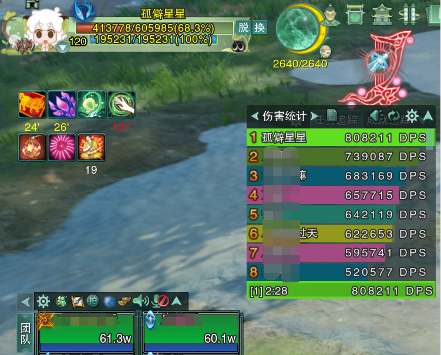
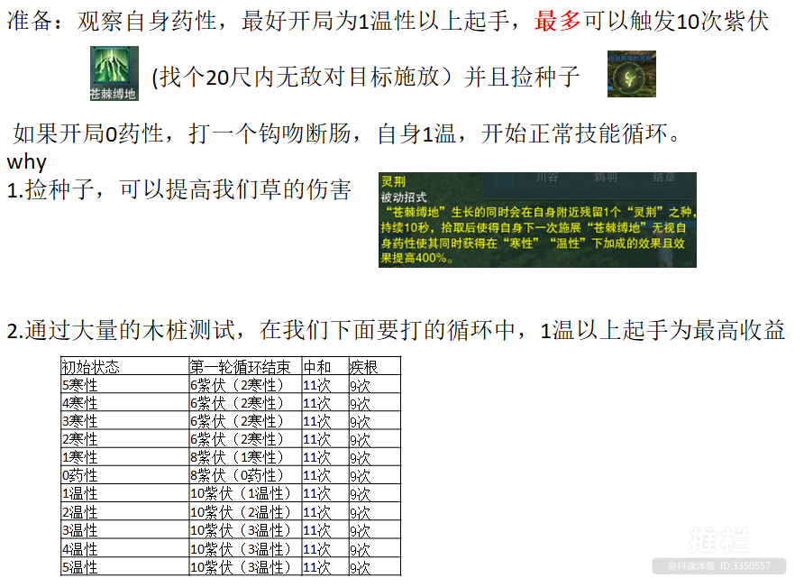
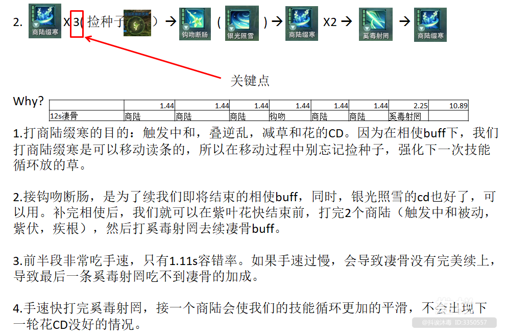

# D2 有基础

孤僻星

# 〇、 约定

首先，无方是可以打出很高的伤害的，在没有大橙武和全身精简装备的情况下也可以通过正确循环打出优秀的dps。

曾经的人参也是一键宏，自打学了无方，养荣不酸了，应理不痛了，输出都能打到第一页了

有更高追求请向有大橙武的大大们学习橙武手法，本人仅为普通玩家（做不起大橙武的狍子）提供无方输出的基本攻略

---

​​

2024‎年‎2‎月2‎8‎日，无小药，装分24w

---

‍

​​

‍

​​

# 循环原理

### 技能的推迟——循环、概率与阈值

提到技能的推迟，以苍紫为标志的经典循环概念再次被我们捡了回来，也再次重新定义了技能cd的价值。

#### 技能cd的价值是如何体现的？

我有一个20秒cd的含飞，如果我**20秒**没有打含飞，而一个应理高手卡cd打，那高手就比我多打一次含飞。

请注意，这句话的重点在于，**20秒**cd这个时间实际上有一定的阈值性质。

> 阈值又叫临界值，是指一个效应能够产生的最低值或最高值。此一名词广泛用于各方面，包括建筑学、生物学、飞行、化学、电信、电学、心理学等，如生态阈值。

如果我只是处理了一个点名导致10秒没有打含飞，接下来依旧卡秒打，那么会发生什么？每20秒中高手有10秒比我多一个含飞，但另外10秒我们含飞数相等。

也就是说，对于未知时间结束的战斗中，没到阈值（这里的阈值就是含飞cd时间，也就是20秒）的技能cd的价值在某些情况下甚至是不存在的。当然，高手的含飞数永远不会比我少，所以推迟依旧是个负收益的行为，只是可以理解为，“不完整推迟一次技能的推迟，其负收益由于在cd的阈值内，所以**不总是能体现**。”

但是，当概率遇上概率之后，会是什么情况呢？

已知：苍紫前的特效是劣质特效，含飞是高频技能容易触发特效，含飞理论上cd价值高于苍紫。

假设：我们先打了苍紫含飞，然后触发了特效，哐哐读川导致循环延长到了24秒，所以含飞cd跑到苍紫前转好了。那么此时应该先打苍紫还是先打含飞？

仔细想想，首先本轮循环（第一轮）橙武特效cd没好，含飞是无所谓先后的，但是下轮循环（第二轮）假如没有出特效，那么末尾的含飞就有很高的出特效概率，同时含飞如果触发了计数中和却又在苍紫前打，那就还丢失了紫伏。

所以，如果下轮循环我不出特效，那么本轮的这个含飞即使在苍紫前打了，那下轮也得老老实实拖cd拖到苍紫后面再打。但如果下轮（第二轮）提前出特效了，那这个含飞就可以依靠特效拉长的循环时间再往前移一些，来离苍紫更远一些避免这个尴尬局面。

再假设，我们在打含飞之前就是计数3，在苍紫前打含飞必丢紫伏，那这种情况下就必然选择含飞挪后了。

但是，如果我们只有计数2，含飞并不会丢紫伏，那么接下来又会怎么样？

假设我们很愉快的在第二轮出了特效，含飞很愉快的再次前移，那么第三轮特效转好后会发现什么？随着含飞的不断前移，含飞离高频技能期（苍紫沾川）越来越近了。而当含飞前的高频技能再次触发特效时，由于特效内总会选择打橙武川，含飞反而又会被橙武特效往后推。也就是说，在橙武特效大于含飞的优先级下，**第二轮的含飞位置和第三轮的含飞位置，在含飞前就出特效的概率局面下，本质上其实没有任何区别**。

### 题外话：含飞cd的价值

注意这里有一个限定条件，“在含飞前就出特效的概率局面下”。换句话说，这个含飞前移的最终意义，实际上是在“没有在含飞前就出特效的概率局面下”，依靠这个前移的含飞以及前移的这段技能打出特效时，才有意义。除此之外的情况，前移都是没有意义的，这就是所谓的“阈值”概念。

再直白一点，这个例子就是之前“高手打含飞”例子的复杂plus版，但结论都是一样的——**高手的操作为部分概率的情况争取到了领先，但也有相当大的概率完全没意义**。随便不准确估算一下的话，**假设第二轮出特效是必然的，那这个操作在第三轮有意义的概率也只有10%上下**。

正如橙武特效收益不高的心法不会过多研究特效处理一样，一个给你带来领先的概率不到10%的操作显然也不值得研究，那么有没有更好的办法来扩大操作优势呢？有。

‍

# 吃种子

如果出现宏不放苍的情况，请将技能释放改为目标模式

​​

​​

兼容远程但是推荐打近战位

远程刀主要通过结草奇穴实现

​​

但是如果出现草不在BOSS脚下或者有技能把草打死了，继续打远程容易丢刀。并且打远程位会损失折枝和折枝沾衣的伤害。

目前体服都可以打近战。

卡4破：团长一般看老一DPS，所以老一不嫌麻烦可以卡4破进本，实战不强求。

方法：1、看人组满了，找个木桩卡4破。2、切药奶，点应时与药，打开千枝绽蕊，用4次白，然后切回无方，调整药性至5寒（空放沾衣或用应理主动温转寒）

吃种子可以通过在MY加入自己的种子焦点，然后勾选启用目标场景追踪来监控，注意，开跨服以后还要加入带自己服务器后缀的。如果是代清多个无方号的，也可以考虑直接监控灵荆，缺点是会监控到队友的。

​​

‍
