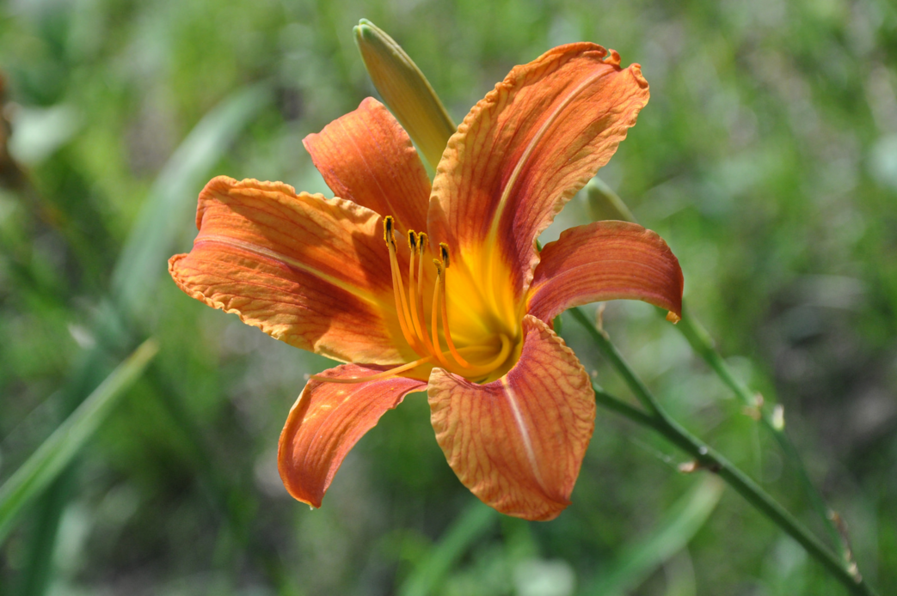
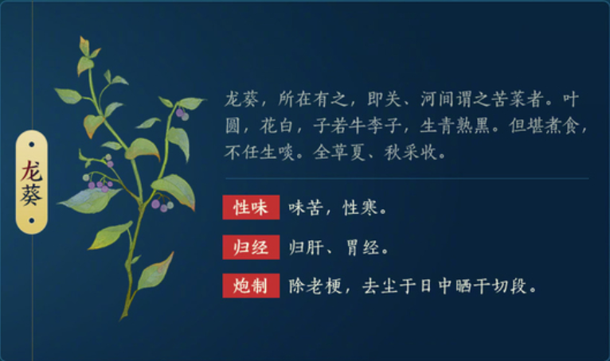

# Z1 溯源

孤僻星

药宗溯源，找到武学的现实背景，发掘中药的实际用途，认识药宗，理解药宗，爱上药宗！

欢迎投稿，支持原创，尊重版权，热爱药宗！

联系Q 2731155821（孤僻星）

---

# 药宗基础

## 心法

### 灵素

​​

汲从百草，承典济芳。此乃药宗一脉相传之术，蕴合《神农本草经》之要义；以百草为根，佐以药性寒、温之效；驱种植株，愈病诊疾，仁心圣手。

**词源**​

南朝 梁 江淹 《伤友人赋》：“友人之生，川岫降明，峻調迥韻，慧志聰情，倜儻遠度，寂寥靈素。”

孙联奎 释：“靈素，心神也。”

### 无方

​​

此功以无方为名，亦代指北天药宗至高典籍《无方制物经》，旨在娴熟使用药理制物，配方运毒。称得上是驱草为刃，毒药双生，足竞百兵之锋。

《无方制物经》终可拼为全本，医药之学，其路修远。  
门中先人著述甚丰，读来顿觉惭愧，我辈更当朝夕不倦，方不负前人苦心。  
吾生而有涯，若能传芳百世，恩泽百代，方为不往。

**词源**

《易·益》：“天施地生，其益无方。”孔颖达疏：“其施化之益，无有方所。”

《谷梁传·昭公十九年》：“就师学问无方，心志不通，身之罪也。”

《孟子·离娄下》：“汤执中，立贤无方。”朱熹集注：“方，犹类也。立贤无方，惟贤则立之於位，不问其类也。”

《庄子·秋水》：“泛泛乎其若四方之无穷，其无所畛域。兼怀万物，其孰承翼？是谓无方。”

## 中和

​​​​

药宗特有的机制“中和”，药宗双心法下均有不同的技能会提供“温”与“寒”。（药宗具有独特的寒温能量条，各自上限都是 5 点）

灵素在释放技能时一点寒性一点温性便能产生一次中和效果，给 30 尺内一个最低血量的友军回复一定治疗量，属于智能单加，灵素的技能核心，点出奇穴或秘籍后会有一定联动性。

无方在释放技能时一点寒性一点温性便能产生一次中和效果，给目标造成一次中和伤害，并附带一层逆乱 buff（最多累计 8 层），部分技能需要在四层逆乱及以上打出造成破招伤害，无方的主要伤害来源。

**词源**

“不同”事物间的最佳的和谐统一关系

物理学：电荷中和。

​​

化学：酸碱中和。

​​

医学：抗毒素或抗毒血清跟毒素起作用。

哲学：中正平和。

《论语·庸也》：“中庸之为德也，其至矣乎。”

“中”即务本，“和”即乐本

中也者无过不及是也，和也者无乖无戻是也。然中固不可废和，和亦不可离中，如礼节乐和本然之体也。礼过于节则严矣，和则淫矣。所以礼尚从容而不迫，乐戒夺伦而皦如，中和一致位育可期，况夫翰墨者哉。

## 凌叶飞霄

门派轻功，大轻功

### 凌霄

**凌霄（** Campsis grandiflora (Thunb.) Schum.）是紫葳科、凌霄属攀援藤本植物。

​​

**可供观赏及药用，花为通经利尿药，可根治跌打损伤等症。**

​​

据李时珍云“附木而上，高达数丈，故曰凌霄”。

​​

​​

## 裁叶饮刃

据闻为了更好地进行解剖试验，药宗先辈曾向庖厨学习解牛之技，此刀法便托生于此。

### 庖丁解牛

庖丁解牛原文

​​

依乎天理，批大郤，导大窾，因其固然，技经肯綮之未尝，而况大軱乎！

‍

# 行忌制方

## 商陆缀寒

​​云凄水漓漓，日暮缀寒归

### 商陆

​​

商陆（Phytolacca acinosa Roxb），商陆科、商陆属多年生粗壮草本植物。​​

​​

根入药，以白色肥大者为佳，红根有剧毒，仅供外用。通二便，逐水、散结，治水肿、胀满、脚气、喉痹，外敷治痈肿疮毒。也可作兽药及农药。果实含鞣质，可提制栲胶。嫩茎叶可供蔬食。

​​

味辛，平，有毒。治水胀，疝瘕，痹，熨除痈肿，杀鬼精物。生川谷。一名䓪根。处处有之，多生山野阴地，其根有赤白两种，赤者有毒，白者入药。​

​​

​​

近年出现过将商陆当作人参误食的案例，登上过微博热搜。

​​

现代应用：

商陆皂苷甲（esculentoside A，EsA） CAS No.：65497-07-6

多项研究表明，商陆皂苷甲在多种急性和慢性的模型中具有抗炎、抗凋亡及抑制肿瘤细胞增殖的作用。

​​​

## 钩吻断肠

​薄草西山下，断肠可知涯

### 钩吻

​​

钩吻（Gelsemium elegans），马钱科、钩吻属植物胡蔓藤，多年生常绿藤本植物，中药。别名断肠草。

​​

中医称其性味为辛、温、大毒，有祛风、攻毒、消肿、止痛、抗炎、催眠等功效，入药后外用，可治顽癣、疥癣、疮患、湿疹、麻疯、风湿、关节炎等症状，同时亦是驱虫药。此外，猪只适量食用可治猪热病及使毛色具光泽。明朝医学家李时珍在其本草学大成《本草纲目》谓：“断肠草人误食其叶者致死，而羊食其则大肥”。

​​​​

野葛生桂州以南，村墟闾巷间皆有，彼人通名钩吻。亦渭苗名钩吻，根名野葛。蔓生，人或误食其叶者，皆致死，而羊食其苗大肥，物有相伏如此，若巴豆，鼠食则肥也。陶云飞鸟不得集之，妄矣。其野葛以时新采者，皮白骨黄，宿根似地骨，嫩根如汉防己，皮节断者良，正与白花藤根相类，不深别者，颇亦惑之。其新取者折之无尘气，经年已后，则有尘气，根骨似枸杞，有细孔者，人折之，则尘气从孔中出，今折枸杞根亦然。《经》言折之青烟起者名固活，为良，此亦不达之言也。且黄精直生如龙胆、泽漆，两叶或四五叶相对。钧吻蔓生，叶如柿叶。

​​

剧毒植物,一叶人口,血溃百窍,令人断肠而死。它的花很美,聚伞形花朵,有红有黄,如一朵芙蓉。它还有个特性,人一靠近,叶子便簌簌颤动,对你表示亲热。

罗浮山里生有断肠草,当地人叫大茶药。当地人说这大茶药是一个被冤而死的女子化成的,冤魂要找个替身才能解脱,而新死者又要再我替身,才能脱离地狱。因此才对你表示亲热,拉你去做替身。

故事：https://baijiahao.baidu.com/s?id=1670326655157175601

传说“神农尝百草”就是因误食钩吻（断肠草）而死。

相传神农氏自小便非常聪颖，常替他人排难解忧。一说神农四肢和头胪以外全身透明，他长著一个透明可见的肠胃，吃下东西时食物在胃里每每也仍清晰能见，而他有抱一副为百姓试药治权之心，于是不断走遍山林荒野，尝尽百草，一试疗效，而当该种药草具毒性时，必能在其通透的胃中看到黑色，从而得知百草药性，更有神农一日而遇七十毒之说。

​​

现代应用：

**钩吻碱** CAS No.：509-15-9

药理药效:具有兴奋中枢神经作用，但毒性很大。可有效减轻慢性疼痛。具有抗伤害和催眠作用，具有抗癌镇痛的作用。

​​

## 川乌射罔

​尤厌乌草毒，侍药岂无辜？

### 川乌

**乌头（学名：** Aconitum carmichaelii Debeaux）是毛茛科、乌头属草本植物。乌头的药用部位是主根加工后称“川乌”，侧根称附子”。

​​​

附子治大汗亡阳，四肢厥逆，霍乱转筋，脉微欲绝，肾阳衰弱的腰膝冷痛，阳痿，水肿，脾阳衰弱的泄泻久痢，脘腹冷痛，形寒畏冷，精神不振，以及风寒湿痹，脚气等症；川乌治中风，拘挛疼痛，半身不遂，风痰积聚，癫癎等症。

​​

乌头的花美丽，可供观赏。

​​

现代应用：

**草乌甲素** CAS No.：107668-79-1

具有良好的镇痛、抗炎等作用，且毒副作用较小，用于治疗风湿和类风湿关节炎的药物，其功效作用还包括治疗腰肌劳损、肩周炎、四肢扭伤以及挫伤等临床症状。

​​

## 沾衣未妨

​何露连泣珠？沾衣且未妨

### 黄芪

猜测是**黄芪**

《金匮要略》中，“黄芪芍药桂枝苦酒汤”最简单，方中黄芪五两，芍药三两，桂枝三两，苦酒一升。汉代没有高度酒，苦酒相当于现在上好的低度酒清酒。也有一些汉方家用醋来代替。

这个方子治疗的患者有几个特征：一是身体浮肿而重；一是全身淌黄汗，汗出**沾衣**，周身如浸水中；一是汗出口渴。

### 露珠

露珠，露的形成原因和过程与霜一样，只不过它形成时的温度在 0°C 以上。闪亮，透明，圆润。

​​

李时珍说：露者，阴气之液也，夜气着物而润泽于道旁也。

文化上，露水经常同纯净和生气勃勃联系在一起。唐刘威所作早春诗中提到：“冰消泉派动，日暖露珠晞。”

​​

甘，平，无毒

秋露繁时，以盘收取，煎如饴，令人延年不饥。(藏器)禀肃杀之气，宜煎润肺杀崇之药，及调疥癣虫癞诸散。（虞抟）

现代应用：

H2O 是水！

## 且待时休

​竞争名芳草，闲待事无忧。

### 萱草

萱草（*Hemerocallis fulva*）看起来长得很像我们吃的黄花菜（*Hemerocallis citrina*），实际上萱草和黄花菜也是「亲戚」，他们同为百合科萱草属植物（*Hemerocallis*）。别称“忘忧草”“母亲花”。竹林七贤之一的嵇康一句“**萱草忘忧**”，可谓是“愚智所共知也”；又有“**北堂幽暗，可以种萱**” 的说法，古代“北堂”代表母亲的意思，有“萱草生堂阶，游子行天涯”。

​​​​

清热利尿，凉血止血。用于腮腺炎，黄疸，膀胱炎，尿血，小便不利，乳汁缺乏，月经不调，衄血，便血。外用治乳腺炎。

​​

宋代著名的本草著作《本草图经》中记载，萱草具有“安五脏，利心志，令人好欢乐无忧，轻身明目”，这一点与嵇康所说的“萱草忘忧”如出一辙。中医四小经典之一的《药性赋》记载的是萱草根，并说“萱草根治五淋而消乳肿”，而萱草根治五淋、消乳肿的功效，在《本草纲目》中也有类似记载。

​​

萱草根，有些种具有毒性，服过量可致瞳孔扩大，呼吸抑制，甚至失眠和死亡，因此必须加以谨慎，要在医师指导下使用，以免发生事故。

​​​​

现代应用：

**萱草素 CAS No.：30311-61-6**

​​

萱草素，英文名 hemerocallis，又称萱草根素。具有止血消炎、清热解毒等功效，有一定神经保健功能。具有很强的脂质过氧化抑制活性。

# 行宜列药

## 白芷含芳

​泉溪通幽谷，拈草谢君怜。

### 白芷

白芷（Angelica dahurica）为多年生高大草本，高 1-2.5 米，根圆柱形，茎基部径 2-5 厘米，基生叶一回羽状分裂，复伞形花序顶生或侧生，果实长圆形至卵圆形。一般生于林下、林缘、溪旁、灌丛和山谷草地。

​​

白芷的花是一团一团的，像一把小伞，非常漂亮，而它的根则是入药的重要部位，每年的夏秋之交，叶黄时采挖，挖出来后除去须根及泥沙，晒干之后，就可以入药了。

​​

味辛，性温。白芷可以止痛，主治风寒感冒，头痛、牙痛、风湿痹痛，鼻渊，带下证，疮痈肿毒。

​​

《纲目》：“白芷，色白味辛，行手阳明；性温气厚，行足阳明；芳香上达，入手太阴肺经。如头、目、眉、齿诸病，三经之风热也；如漏、带、痈疽诸病，三经之湿热也；风热者辛以散之，湿热者温以除之。为阳明主药，故又能治血病、胎病，而排脓生肌止痛。治鼻渊、齿痛、小便出血，眉棱骨痛，大肠风秘，妇人血风眩运，翻胃吐食；解砒毒，蛇伤，鼻衄、刀箭金疮。”

​​

现代应用：

​​

白芷提取物主要含有香豆素类和挥发油成分，具有抗炎、镇痛、抑制病原微生物、抗肿瘤、保肝等多种药理活性。被广泛应用于食品、保健品、香料、护肤美容、日用化工等方面。

## 赤芍寒香

​川谷避人颜，赤芍暗透香。

### 赤芍

​​

芍药（Paeonia lactiflora Pall.）是芍药科、芍药属的多年生草本植物。芍药是中国的传统名花，被人们誉为“花仙”和“花相”，且被列为“六大名花”之一，又被称为“五月花神”，因自古就作为爱情之花，已被尊为七夕节的代表花卉。且在中国文化中一直是绘画艺术中的常见花卉，象征友谊、情爱。

​​

 **《神农本草经》：“芍药，味苦平。主邪气腹痛，除血痹、破坚积寒热疝瘕、止痛“**

​​

赤芍为毛茛科植物芍药或川赤芍的干燥根。春、秋二季采挖，除去根茎、须根及泥沙，晒干。苦，微寒。归肝经。有清热凉血，活血祛瘀的功效。赤芍是著名野生地道中药材。

​​

用于热入营血，温毒发斑，吐血衄血，目赤肿痛，肝郁胁痛，经闭痛经，癥瘕腹痛，跌扑损伤，痈肿疮疡。
炒赤芍：炒后药性偏于缓和，活血止痛而不伤中，可用于瘀滞疼痛。
酒赤芍：以活血散瘀力胜，清热凉血作用较弱。多用于闭经或痛经，跌打损伤。

​​

现代应用：

芍药苷 **CAS No.：** 23180-57-6

​​

能明显增强肝细胞 DNA 合成，显著促进 ^3^H-胸腺嘧啶核苷掺入肝细胞。注射剂或赤芍苷能直接扩张冠状动脉，对急性心肌缺血有保护作用。煎剂、芍药苷能抗血小板聚集、抗血栓形成。

## 当归四逆

​四逆足肢冷，当归暖药生。

### 当归

​​

当归（Angelica sinensis），属伞形科的一种植物，别名：白蕲、干归、补血草、马尾归。

​​

多年生草本植物，高 0.4～1 米。茎直立，有纵直槽纹，无毛。二或三回三出式羽状复叶，小叶卵形，浅裂或有缺刻。开白色花，复伞状花序，顶生。矩圆形双悬果，侧棱有宽翅，边缘为淡紫色。花期 6～7 月，果期 7～8 月。

​​

甘、辛，温。归肝、心、脾经。补血活血，调经止痛，润肠通便。可作为温和的镇静剂、缓泻剂、利尿剂、抗痉挛剂和减轻疼痛、改善血液、强化生殖系统，帮助身体利用荷尔蒙。《神农本草经》等中医学典籍把当归列为无毒的上品药。

​​

相传在很久以前，有对十分恩爱的夫妻，过着快乐幸福的日子，但妻子不幸罹患重病，多年来各处求医均无效，丈夫发誓要治好妻子的病，便亲自到人迹罕至的深山里采药，临行对妻子说，若经过三年未返，一定是死于他乡，你便可以改嫁他人。时光飞逝，三年匆匆流过，丈夫果然未回家，妻子因生活所迫，只得改嫁他人。但世事难料，改嫁不久，前夫竟采得药草归来，妻子深觉愧对前夫，便服下前夫送来的草药，意欲自尽谢罪，结果反而把病治好。后来，人们就把该草药，取名为“当归”。李时珍在《本草纲目》中，写道：“当归本非芹类，特以花叶似芹故得芹名，古人娶妻为嗣续也，当归调血为女人要药，有恩夫之意，故有当归之名”。

​​

现代应用：

当归提取物中当归挥发油含量约 0.4%，油中的成分非常复杂，其中中性油占总油的 88%，主要有藁本内酯(Ligustilide)、正丁烯基苯酞(n-Butylidenephthalide)、川芎内酯(Cnidilide)、亚丁基苯酞(ButChemicalbookylidensph-thalide)、当归酮(AngelicaKetone)、新当归内酯(Angelicide)、松柏醇阿魏酸酯、邻羧基苯正戊酮(n-Valerophenone-o-carboxylicacid)等约 19 种中性挥发油。

​​

主要作用调经止痛，补血养血，活血止痛，润肠通便。主治月经不调，经闭腹痛，癥瘕结聚，崩漏；血虚头痛，眩晕，痿痹；肠燥便难，痈疽疮疡，跌扑损伤；用于镇痛，止咳，增强肠胃吸收能力；酒当归活血通经。用于经闭痛经，风湿痹痛，跌扑损伤。有抑制肿瘤作用。另外日本学者还证明中国产当归与东当归镇痛作用相近。当归提取物能抑制血小板 AA 代谢和血小板 5-HT 释放，有温和的镇痛作用。

### 当归四逆汤

当归四逆汤，中医方剂名。为温里剂，具有温经散寒，养血通脉之功效。主治血虚寒厥证。手足厥寒，或腰、股、腿、足、肩臂疼痛，口不渴，舌淡苔白，脉沉细或细而欲绝。临床常用于治疗血栓闭塞性脉管炎、无脉症、雷诺病、小儿麻痹、冻疮、妇女痛经、肩周炎、风湿性关节炎等属血虚寒凝者。

​​

【组成】当归（12 克）、桂枝（9 克）、 芍药（9 克）、 细辛（3 克）、 通草（6 克）、 大枣（8 枚）、 炙甘草（6 克）。

【功用】 温经散寒，养血通脉。

【用法】 上七味，以水八升，煮取三升，去滓，温服一升，日三服（现代用法：水煎服）。

## 龙葵自苦

​寒凉孤守夜，自苦为哪般？

### 龙葵

​​

龙葵（Solanum nigrum L.），茄科茄属一年生草本植物，茎近无毛或被微柔毛，叶互生，卵形或卵状椭圆形，叶常无毛；花小且下垂，花冠白色或淡紫色；浆果为球形，熟时黑紫色，有光泽；种子多数，卵形芝麻状，黄色；花期 6-9 月，果期 7-12 月。异名有苦菜，天茄子。

​​

据《唐本草》和《本草纲目》记载，龙葵根具有治痢疾、跌打损伤、痈疽肿毒的作用；龙葵子具有治急性扁桃体炎、疗疮的作用。龙葵具有清热解毒、活血化瘀的功效，其果实味道酸甜爽口，可直接食用，能为人体补充大量维生素和多种矿物质。 龙葵具有一定观赏性，可作盆栽或观赏植物养殖。龙葵花的花语是沉不住气，寓意着比较冲动，不太稳重。

​​

全株入药，可散瘀消肿，清热解毒。 性寒，味苦。有小毒。主治疔疮、痈肿、跌打损伤等。

成熟的龙葵果实美味可口，但我们也要注意，因为未成熟的龙葵果实和茎、叶里含有一种名为“龙葵碱”的毒性物质。这种生物碱能刺激和腐蚀胃肠道黏膜，麻痹中枢神经，对红细胞产生溶血，损害心肌等，并能导致孕早期小鼠胚胎致畸、突变或死亡，具有一定的胚胎毒性。

在没有成熟的番茄和发芽的马铃薯里“龙葵碱”的含量也很高，食用它们时也要小心。 **（发芽的土豆中就是龙葵碱）**

​​

现代应用：

龙葵碱 CAS No.：20562-02-1​

​​

茄碱对热稳定，一般烹煮不会受到破坏。茄碱是一种胆碱酯酶抑制剂，人畜摄取过量均会引起中毒。早期症状为舌咽麻痒、胃部灼痛、呕吐、腹泻，继而瞳孔散大、耳鸣、兴奋，重者抽搐、意识丧失，甚至死亡。用于生化研究。以前用于治疗支气管炎、癫痫和哮喘。龙葵作为活性成分可以制备预防和治疗肿瘤、糖尿病、哮喘病、冠心病等疾病的药物。

## 灵素还生

​将子无死，尚复能来。

《白云谣》是先秦诗人所作的一首诗，出自《穆天子传》。

白云在天，丘陵自出。
道里悠远，山川间之。
将子无死，尚复能来。

远去的人，已不可见。只有白云悠悠，尚在山间缭绕。
道路悠远，山重水复，何时能回？何时能见？
但愿你还能活着，还能回来，你我还能再相见。

## 七情和合

​喜怒悲忧恐，伤情五脏中。

### 七情

​​

  喜、怒、哀、惧、爱、恶、欲，七者

### 配伍七情

  单行、相须、相使、相畏、相杀、相恶、相反

​​

七情之一：单行：单用一味药来治疗某些病情单一的疾病；

七情之二：相须：两种性能功效相类似的药物配合使用，可以增强原有药物的功效 **（提高药效的配伍方法）** 。

七情之三：相使：性能和功效方面有某些共性，或者性能功效虽不相同，但是治疗目的相一致的药物配合使用，而以一种药为主，另一种药为辅，辅助药能够提高主药的功效 **（提高药效的配伍方法）** 。

七情之四：相畏：一种药物的毒副作用被另外一种药物所降低或者消除 **（减毒的配伍方法）** 。

七情之五：相杀：一种药物能够降低或者消除另外一种药物的毒副作用（**减毒的配伍方法**）。

七情之六：相恶：两药相合用，一种药物能使另外一种药物的功效降低，甚至丧失功效（**配伍禁忌**）。

七情之七：相反：两种药物同时使用能产生或者增强剧烈的毒副作用（**配伍禁忌**）。

# 凌波飞叶令

## 银光照雪

​  敛刃银光雪，天将放日还。

## 凌然天风

​  客里携月等，凌然意天风。

## 惊鸿略水

  晚岁惊鸿雁，休哀夙志难。

## 回风微澜

​  扬波寂静潭，穿风回倚澜。

## 含锋破月

​  斜锋破残月，误泄银满辉。

## 飞叶满襟

​  摇落东风恨，飞翠阔袖襟。

## 青圃着尘

  翠减红衰就，青圃怒还真。

# 神农百草决

## 千枝

​  难秀一枝独，牵叶蕊花黄。

## 苍棘缚地

​  缚地茁青灵，苍击破海移。

### 荆棘

荆棘是一类植物，它原来是指两种植物：荆和棘。棘与荆在野外常混生，因此就产生“荆棘”。荆：荆条，无刺；棘，酸枣，有刺。

现实中没有带刺的攀爬藤曼，均来自艺术创作将藤曼与荆棘的概念混合，产生了荆棘丛的艺术形象。

​​

现实中没有这种荆棘丛。

​​

黄荆，小枝呈四棱形，长有灰白色绒毛，无刺，称为荆。

​​

荆条晾干后可以编框，负荆请罪的荆条也是这种植物。

​​

酸枣树，带刺，称为棘。

​​

Euphorbia milii，带刺的多肉植物，欧洲称荆棘。

​​

玫瑰花的茎，亦被成为荆棘。

## 紫叶沉疴

​  沉疾奈何东，紫叶去江东

### 紫叶

不知道是什么植物，看不出来，待补充

### 沉疴

    意思是久治不愈的病。出自于《晋书·乐广传》。

## 青川濯莲

  青卷红微透，弄波洗自由。

### 莲花

荷花（Nelumbo sp.）属山龙眼目、莲科，是莲属中 2 个物种“莲花”和“黄莲花”及众多人工培育品种的通称。 是多年生水生草本花卉。

​​

中药中莲花为睡莲科植物**莲**的**花蕾**。6～7 月间采收含苞未放的大花蕾或开放的花，阴干。

​​

性温味苦，入心、肝二经，有活血止血、去湿消风、清心凉血、解热解毒的功效，常用于暑热烦温、咳血咯血等。主治疗损伤呕血；血淋；崩漏下血；天泡湿疮；疥疮瘙痒。《纲目》："苦甘，温，无毒。"

​​

现代应用：莲花含槲皮素（quercetin），木犀草素（luteolin），异槲皮甙（isoqurcitrin），木犀草素葡萄糖甙（luteol-inglucoside），山柰酚（kaempferol），山柰酚-3-半乳糖葡萄糖甙（kaempfrol-3-galactoglucoside）及山柰酚-3-二葡萄糖甙（kaempferol-3-diglucoside）等。

莲花花瓣提取物具有对免疫功能下降的个体有益的治疗特性。

## 枯木苏息

  枯木懒锄根，坐邀东君复。

## 逐云寒蕊

​  希冀逐寒蕊，一睹沐天芳。

### 野草

​​

根据技能释放时的特效来看，大概是两种草——皇竹草、野老鹳草或通泉草。因为是艺术创作所以不确定现实依据，待捉虫。

​​

​​

    皇竹草

​​

​​

	野老鹳草

​​

    通泉草

## 绿野蔓生

​  青嶂野烬一平，迟徊藤蔓生

### 葎草（剌剌秧）

葎草（Humulus japonicus），又称剌剌秧、剌剌藤、五爪龙、割人藤，多年生茎蔓草本植物。

​​

性味：全草：甘、苦、寒。效用：全草：清热解毒，利尿消肿。治淋症，小便淋浊，疟疾，泄泻，痔疮，风热咳嗽，健胃，强壮；叶：解热，镇静，健胃，消炎，利尿，治蛇伤；根：治石淋，疝气，瘰疬。茎叶煎来服用能治疟疾去痢血。也能利尿消炎健胃治肿毒。

​​

在过往商业饲料未普及之时，农民常收割本物种的嫩茎和叶做食草动物饲料。葎草的嫩叶和嫩芽可以吃，汆烫去除苦味后，其实咀嚼起来口感还不错，它也是药用植物。葎草的叶脉（背面）也生长着细小的逆刺，做为自然界天然的屏障。

​​

现代应用：

全草含木犀草素（luteolin)，葡萄糖甙，胆碱（choline），天冬酰胺（asparamide）及挥发油等；挥发油主要含 β-葎草烯（β-humulene），丁香烯（caryophyllene），α-（王古）（王巴）烯（α－copaene)，α-芹子烯（α－selinene），β-芹子烯（β-selinene）和 γ-毕澄茄烯（γ-cadinene）等。

茎、叶的乙醇浸液在试管内对革兰氏阳性菌有显着抑制作用。葎草酮与蛇麻酮(参见啤酒花条)相似，也有抗菌作用；对革兰氏阳性及阴性细菌、某些真菌、酵母菌的生长有抑制作用。

‍

# 武技图

## 当归四逆

取自长白山天池原景

​​

## 龙葵自苦

​​

​​

‍

# 奇穴

## 灵素

### 反佐

      中药配伍方法之一，见于《素问·至真要大论》。处方时应用与方中主药性能不一致的辅佐药物,如在寒凉剂中佐以温热药,温热剂中佐以寒凉药等。

### 收涩

      收涩又称固涩药(drugs for arresting discharge)，以收敛固涩为主要作用的一类中药。性味大多酸、涩，性多温或平。归经：主入肺、脾、肾、大肠经，有固表止汗、涩肠止泻、固精缩尿、固崩止带、收敛止血、敛肺止咳等作用。

### 鬼卿

      鬼卿

徐长卿（Vincetoxicum pycnostelma Kitag.）是夹竹桃科白前属多年生直立草本植物，首见于《神农本草经》，别名“鬼督邮””鬼卿“。

​​

      配当归 治漏，疳，虫蚀 （《普济方》藁本散）

### 寸草

      孟郊 《游子吟》
        谁言寸草心，报得三春晖。

### 不染

        刘禹锡 《陋室铭》
        莲，出淤泥而不染，濯清涟而不妖

### 木通

      木通

​​

        木通为性喜温暖气候，不耐寒。

### 水苏

      水苏

​​

水苏可疏风理气，止血消炎。具有治疗感冒、肺痿、肺痈、头风目眩、口臭、咽痛、痢疾、吐血、跌打损伤的功效。

### 相须

      中医里关于中药配伍的一种称谓
      两种功能相类似的药物配合使用

### 顾步

      顾步汤
        中医方剂名。出自《辨证录》卷十三。具有大补气血，泄毒之功效。主治脚疽。

### 忘忧

      《论语·述而》 ：“其为人也，发愤忘食，乐以忘忧。”
      萱草的别名，忘忧草。

### 决明

      决明子

​​

决明子味苦甘而咸，性微寒，入肝、肾、大肠经，功能润肠通便，降脂明目、解毒利湿，可用于治疗目赤涩痛、羞明多泪、头痛眩晕、目暗不明。

### 流银

      木心 日照摇金，月笼流银。

### 吹绽

      李煜《虞美人·东风吹绽海棠开》  
        东风吹绽海棠开，香榭满楼台。  
      苏轼《浪淘沙·探春》  
        料想春光先到处，吹绽梅英。

### 晴柔

      杨万里《小池》  
        泉眼无声惜细流，树阴照水爱晴柔。

### 清嘉

      柳永《望海潮》  
        重湖叠巘清嘉，有三秋桂子，十里荷花。

### 飘黄

      柳永《玉蝴蝶·望处雨收云断》  
        水风轻，蘋花渐老，月露冷、梧叶飘黄。

### 渡若

      杜牧《江南春》  
        万里赴戎机，关山渡若飞。

### 浅碧

      李清照《鹧鸪天·桂花》  
        何须浅碧深红色，自是花中第一流。

### 挂雨

      柳永《竹马子·登孤垒荒凉》  
        对雌霓挂雨，雄风拂槛，微收烦暑。

### 配伍

      七情配伍

### 幽姿

      陆游《朝中措·梅》  
        幽姿不入少年场。无语只凄凉。

### 双生

      双生(俗称桑寄生)

​​

木本半寄生植物，甘补血，血得补则发受其灌荫而不枯脱落矣。故凡内而腰痛、筋骨笃疾、胎堕，外而金疮、肌肤风湿，何一不借此以为主治乎。

### 同梦

      苏轼《西江月·梅花》  
        高情已逐晓云空，不与梨花同梦

### 辞零

      何良俊《乙卯八月余觞客青溪之上坐有李节鸣筝质山咏》  
        弦滑酒香花正好，不辞零露夜沾衣。

### 独活

      独活

​​

辛散苦燥，微温能通，主入肾、肝经，兼入膀胱经，药力较羌活为缓。作用偏里偏下，主散在里伏风及寒湿而通利关节止痛，尤善治少阴伏风头痛。

### 零尘

      陆游《卜算子·咏梅》  
        零落成泥碾作尘，只有香如故。

### 胜娇

      李弥逊《临江仙(次李伯纪韵)》  
        小捻青枝撩鼻观，绝胜娇额涂黄。

### 旋生飞草

      飘零轻似羽，推风向天涯。  
      蒲公英

​​

蒲公英植物体中含有蒲公英醇、蒲公英素、胆碱、有机酸、菊糖等多种健康营养成分。性味：苦甘，寒。清热解毒，利尿散结。

### 释冰

      明·杨慎《序》：“苦思精索，一旦豁然，若有神悟，离章错简，雾释冰融。”

### 自馨

      挽联  
        松柏春常在，芝兰德自馨

### 岚微香馥

      此夜寒草香，岚微馥满怀  
      寒草指龙葵

### 应时与药

      百药应病理，因时养太和

### 犹解倒悬

      老病犹难解，扶危去姓名  
      扶危  
        三国志 ˙ 卷三十八 ˙ 蜀书 ˙ 许靖传：『今日足下扶危持倾，为国柱石。』  
        明 罗贯中 《三国演义》一回： “三人焚香再拜而说誓：‘念刘备、关羽、张飞，虽然异姓，既结为兄弟，则同心协力，救困扶危；上报国家，下安黎庶；不求同年同月同日生，只愿同年同月同日死。’”

### 卫矛

      卫矛

​​

        《神农本草经》记载：“卫矛，味苦，寒。主女子崩中下血，腹满汗出；除邪，杀鬼毒、蛊疰。”  
        《图经》曰：“卫矛，即鬼箭也；三月后生苗，长四、五尺，其干有三羽，状如箭翎。”(不是见血封喉的鬼箭）  
	苦，寒。行血通经，散瘀止痛。用于经闭、症瘕，产后瘀滞腹痛，虫积腹痛，漆疮。

### 百药宣时

      取断山河秀，百草同宣时

## 无方

### 川谷

      川谷

​​

别名草黍子、菩提珠、薏苡仁 、草珠子、苡米。性凉，味甘、淡。健脾渗湿，除痹止泻。

### 祛邪

      《内经》“实则泻之”的运用

### 鸩羽

      《晋书·后妃传论》：“ 南风肆狡，扇祸稽天。初践椒宫，逞枭心于长乐 ；方观梓树，颁鸩羽於离明。”

### 生地

      生地黄

​​

性寒，味甘苦。清热凉血，养阴生津 用于因温病或热毒而吐衄、发斑，可以清火、解热、凉血而止血。

### 结草

      结草衔环

### 苦苛

      猜测为 苦涩的小草

### 谢枝

      宋代周行己的《杨花》寄谢枝与叶，邂逅复何时。

### 茎奚

      战国《杨朱第七》“既死矣，奚为焉？”曰：“为子孙。”“茎奚益于子孙？”

### 坚阴

      指平相火，固肾阴的治法。  
      《素问·脏气法时论》：“肾欲坚，急食苦以坚之。”

### 相使

      在性能功效方面有某种共性的药物配合应用

### 熟地

      熟地黄

​​

甘，微温。归肝、肾经。补血滋阴，益精填髓。大补。

### 渐苞

      《书·禹贡》：“厥土赤埴坟，草木渐包。”  
      晋 左思 《蜀都赋》：“紅葩紫飾，柯葉漸苞。”

### 南草

      南草生古木，岁晚不知秋  
      续断（南草，龙豆）

​​

因能“续折接骨”而得名。活血生肌药物的同时还兼具止血止崩漏的功效。

补肝肾，续筋骨，调血脉。治腰背酸痛，足膝无力，胎漏，崩漏，带下，遗精，跌打损伤，金疮，痔漏，痈疽疮肿。

续断经过“发汗”后，总皂苷和醇溶性浸出物都有所降低，而治疗白血病的主要活性物质皂苷 VI 含量有所提升。

### 凄骨

      《小石潭记》"凄神寒骨，悄怆幽邃"

### 芳时

      唐·白居易《裴常侍以题蔷薇架十八韵见示因广为三十韵以和之》：霁景朱明早，芳时白昼长。秾因天与色，丽共日争光。

### 蓬茸

      《楚辞·九辩》“惟其纷糅而将落兮” 汉 王逸 注：“蓬茸颠仆，根蠹朽也。”

### 紫伏

      伏生紫堇（夏天无）

​​

“行血、活血、止血、止痛、镇痉。”夏天无有活血通络、行气止痛、祛风除湿的功效。

### 避奚

      今奚为奚据？奚避奚处？奚就奚去？奚乐奚恶？

### 滞眠

      睡眠障碍

### 肃羽

      诗经“鸿雁于飞，肃肃其羽”

### 甘遂

      甘遂

​​

味苦；性寒；有毒。甘遂. 【归经】脾经；肺经；肾经；膀胱经；大肠经；小肠经。 【功能】泻水逐肿，消肿散结。

### 折枝拂露

	折枝留春

### 炮阳

      旧时节令中的“冬至”一天，太阳的高度最低，天气也最寒冷。

### 荡襟

      宋朝诗人方千里《倒犯》“荡尘襟，写名醥。”

### 养荣

      养荣汤

出自《万病回春》卷二。主治风中血脉，四肢不举、口不能言；及痰迷心窍，不省人事，舌强不能语言，痰涎壅，盛，口眼喎斜，半身不遂。

组成：黄芪一两(30 克)、当归一两(30 克)、桂心一两(30 克)、炙甘草一两(30 克)、陈皮一两(30 克)、白术一两(30 克)、人参一两(30 克)、白芍药三两(90 克)、熟地黄三分(古制应为七钱半，约 22 克)、五味子三分(古制，应为七钱半约 22 克)、茯苓三分(10 克)远志半两(15 克)、生姜 2 片、大枣 3 枚。

### 香繁饮露

      香繁饮露迟，绿野未沾衣  
      《庄子》肌肤若冰雪，淖约若处子；不食五谷，吸风饮露

### 并蒂夺株

      雨晦胡为路，降株夺草魂。  
      并蒂莲

​​

中国传统文化中，并蒂莲被认为是善良和美丽的化身。和莲花没有什么不同。

### 应理与药

      百药应病理，因时养太和

‍
