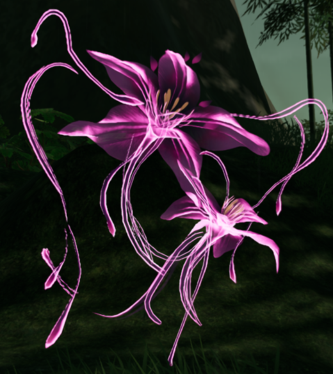

# 待解读

# 1

沾衣未妨的不知名花草纹

​​

猜测是**黄芪**

《金匮要略》中，“黄芪芍药桂枝苦酒汤”最简单，方中黄芪五两，芍药三两，桂枝三两，苦酒一升。汉代没有高度酒，苦酒相当于现在上好的低度酒清酒。也有一些汉方家用醋来代替。

这个方子治疗的患者有几个特征：一是身体浮肿而重；一是全身淌黄汗，汗出沾衣，周身如浸水中；一是汗出口渴。

# 2

### 紫叶

不知道是什么植物，看不出来，待补充

​​
